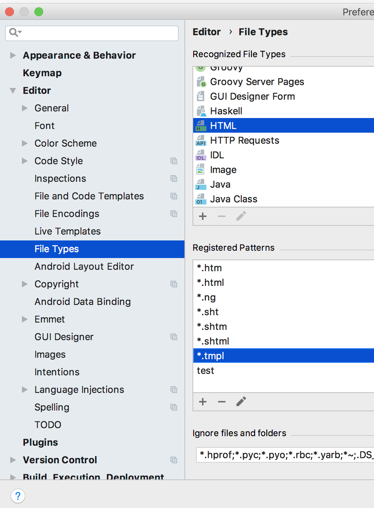
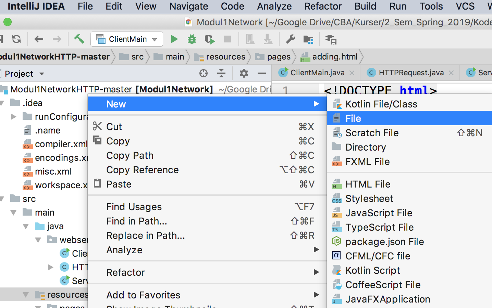

# HTTP protokollen og netværk: opgaver onsdag/torsdag

## Ressourcer

- [Note om netværk](./NoteNetværkHTTP.md)
- [Link til kode](https://github.com/bornholm2sem2019/Modul1NetworkHTTP) (skal opdateres)
- [Slides fra mandag](./Week1Network.pptx)

## Opgave 1. (grøn)

 I den løsning der hedder picoserver06 bruges der en konstant der hedder `RES`. Denne opgave går ud på at få denne fil til at være i `resources` kataloget.

- Lav en fil `result.tmpl`(tmpl for "template") med samme indhold som RES variablen sidst i `ServerMain.java`. Denne fil skal være i `resources`.
- Hvis I ikke lige ved hvordan man laver en ny tom fil, så kik nederst på denne side
- I stedet for at bruge `RES` variablen skal man i `addOurNumbers` metoden læse indholdet fra `result.tmpl` filen (husk der er en metode i `ServerMain.java` der kan læse en fil fra resources).

## Opgave 2. (gul)

Metoden 'addOurNumbers' gør 3 ting. Den finder de to parametre i HttpRequest, den laver dem om til heltal og lægger dem sammen, og endelig genererer den en ny html side ud fra templaten. Du skal her programmere en metode `String generateHTML(String file, String a, String b, String c)` hvor a, b og c er de værdier der skal sættes ind i filen (på pladserne $0, $1 og $2 - så vi kan generere HTML ud fra en template fil i resource kataloget. Denne metode skal så kaldes fra `addOurNumbers` så addOurNumbers ikke skal læse fil heller ikke lave replace.

## Opgave 3. (rød)

Der findes en særlig Java syntaks til at tillade et variabelt antal parametre af samme type. Søg efter "java varargs". Lav en metode `generateHTML` der stadig tager resource fil navn som første argument, men som derefter tager et vilkårligt antal parametre sådan at man kan bruge templates med vilkårligt antal parametre. Husk at filnavn skal indeholde mappenavn, hvis man har lagt den i en undermappe.

## Opgave 4. (grøn)

Udvid programmet sådan at man har to knapper på siden, en knap der lægger sammen, og en anden der ganger. Der skal laves om i HTML siden, og der skal laves om i `picoServer06`, og der skal sikkert laves en metode `multiplyOurNumbers` der minder om `addOutNumbers`.

## Opgave 5. (grøn)

Lav en html side og vis på fredag hvordan du få den frem i browseren vha. at skrive en passende URL. Den skal kunne vises vha. `picoServer04`. Vær forberet på at redegøre for alle aspekter af løsningen.

## Opgave 6. (gul)

Lav samme opgave som ovenfor, men med udgangspunkt i `picoServer05`.

## Hint:  Lav en ny tom fil i IntelliJ

For at kunne oprette filen result.tmpl i fredagens opgave 1 skal du lave et par småting i IntelliJ. Først skal du tillade IntelliJ at redigere i filer af typen *.tmpl. Se hvordan du knytter filtyper som ender på .tmpl til HTML dokumenttyper herunder:

Når det er gjort, kan du oprette en tom fil således:

