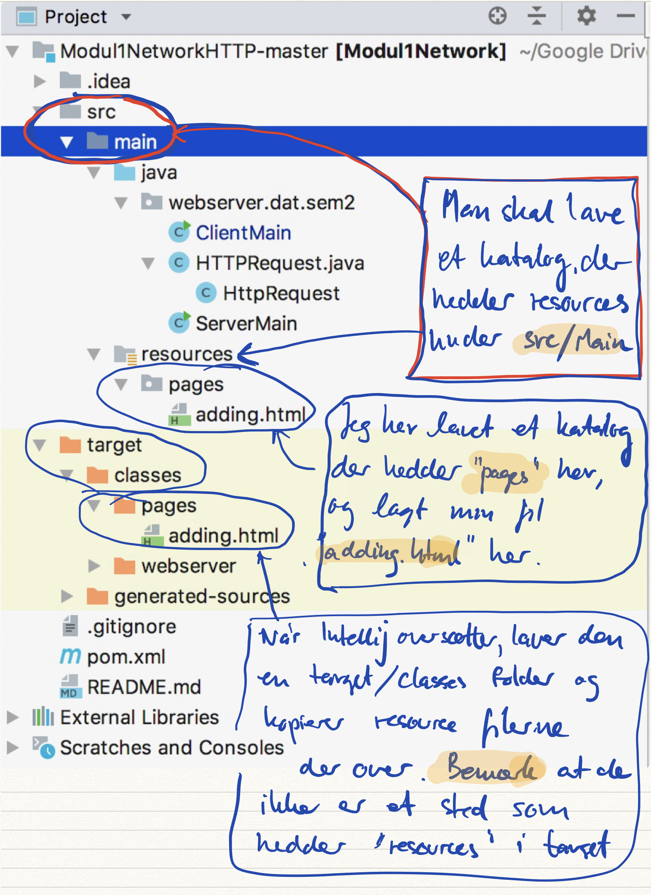

# Netværk & http (note uge 1)

Denne note indeholder tre dele, en del om netværk, en del om http, og endelig en del om java resourcer (fordi vi har brug for dem til at få eksemplerne til at virke).

## Netværk

Det centrale du skal kende til for at kunne forstå netværksprogrammering er:

* IP-adresser - computerens "telefon nummer" på internettet
* Port-numre - hvilket program på computeren ønsker man at tale med
* Protokol - hvordan skal vi snakke når der er oprettet forbindelse
* Lokale netværk - f.eks. et wifi, eller telefon hotspot

I øvelserne til denne uge kommer vi omkring alle dele. Vi kommer kun til at se på en protokol, nemlig den der hedder http. 

### Internettets opbyning

Når man skriver en URL i browseren og får svar tilbage fra serveren kommer alle dele i brug. 

En http URL ser ud på denne måde: `http://ipaddress:port/path?query`. 

#### IP-adresse
Der er to forskellige måder at angive en IP adresse på. Dels kan man angive selve IP adressen. Det er fire tal mellem 0 og 255. Et eksempel kunne være Danmarks Radios hjemmeside, som har 159.20.6.38, eller facebook, der har 31.13.64.35.

Som bekendt behøver man ikke at skrive http://159.20.6.38 hvis man vil se Danmarks Radios hjemmeside. Din computer benytter sig af nogle specielle computere, der er på nettet, der hedder "DNS" (Domain Name System). En DNS er en computer på nettet som har en tabel over hvilken IP adresse, der hører til hvilket navn. Din browser har inbygget en række velkendte DNS (Google har f.eks. en DNS på 8.8.8.8).

Ved hjælp af en IP adresse kan du få fat i en anden computer på internettet.

### Server, Port, Socket

En server er først og fremmest et program, der kører i "baggrunden" på en maskine. I daglig tale kalder man ofte maskiner, som står gemt væk i store serverrum for servere, men det er egentlig lidt misvisende, da man også kan køre serverprogrammer på sin egen lille laptop. I praksis bruger man dog ordet "server" om begge dele, og det gør vi også.

Normalt beder vi vores browser om at hente en html side på en server (ud fra dens IP addresse). Hvis man ikke skriver noget specielt, så vil browseren henvende sig på port 80, som er standard porten for en web server. Men vi kan bede servere om meget andet end html sider. Vi kan bede en mail server om at levere os emails, vi kan bede en mail server om at sende emails, vi kan bede om skærmdeling, en ftp-server om at sende en fil, en printerserver om at udskrive et dokument osv. 

Når vi prøver at få fat i en server, så skal der være et program på denne server der er parat til at håndtere denne henvendelse. For at serveren kan håndtere mere end en type af henvendelser, så er der flere programmer, der kan køre samtidigt, og de får så hver et port nummer. En webserver lytter ofte på port 80, men kan man kan bruge et vilkårligt portnummer (Der er visse begrænsninger på portnumre under 1024 da de er [reserveret til diverse standarder](https://en.wikipedia.org/wiki/List_of_TCP_and_UDP_port_numbers)). 

Du vil sikkert opleve, at port og socket bruges i flæng. Til vores brug er "i flæng" godt nok. 

> Bemærk - man kan godt have klient og server på samme maskine. Der er et særligt navn, der hedder **localhost** (som har ip nummer 127.0.0.1). Dvs, at hvis man vil hente en html side med navnet index.html fra en lokal webserver, så skriver man http://localhost/index.html eller http://127.0.0.1/index.html i sin browser.

#### Klient og Server
I eksemplerne ovenfor er det en browser, der snakker med en webserver. Serveren er den der har et program der sidder og venter på at der kommer en henvendelse. Klienten er det program der henvender sig. 

Java programmet nedenfor er en simpel webserver der lytter på port 8080.

```java
    private static void main(String args...) throws Exception {
        final int port = 8080;
        final ServerSocket server = new ServerSocket( port );
        System.out.println( "Listening for connection on port "+ port + " ...." );
        while ( true ) { // keep listening (as is normal for a server)
            try ( Socket socket = server.accept() ) {
                System.out.println( "-----------------" );
                System.out.println( "Client: " + 
                			socket.getInetAddress().getHostName() );
                System.out.println( "-----------------" );
                BufferedReader br = new BufferedReader( 
                			new InputStreamReader( socket.getInputStream() ) );
                String line;
                while ( !( ( line = br.readLine() ).isEmpty() ) ) {
                    System.out.println( line );
                }                
                String httpResponse = "HTTP/1.1 200 OK\r\n\r\n" + "Hello 2. Sem";
                socket.getOutputStream().write( httpResponse.getBytes( "UTF-8" ) );
            }

        }
    }
```
1. I linje 3 laves et `ServerSocket` objekt der kan lytte på port 8080. 
2. I linje 6 kaldes metoden `server.accept`. Denne metode sætter programmet til at vente på at et klient program henvender sig på port 8080 på den maskine som programmet kører på.
3. Når klienten så henvender sig, oprettes der et Java `Socket` objekt som holder forbindelsen mellem serveren (dette program) og klienten (f.eks. browseren).
4. Ud fra et socket objekt kan man få fat i andre objekter og informationer. F.eks.
	* I linje 9 henter man info om hvilken klient der er i den anden ende af forbindelsen.
	* I linje 11 og 12 oprettes en `BufferedReader` der kan læse hvad klienten sender (Vi får denne forbindelse gennem `socket.getInputStream()` i linje 12). Et HTTP request følger et helt specielt format. I linje 13-16 læser vi indtil første blanke linje (det kaldes headeren - se mere om HTTP protokollen nedenfor).
	* I line 18 bruger vi socket til at få fat på en output stream så vi kan sende et svar tilbage til klienten (`socket.getOutputStream()`).

## http
HTTP er en protokol, som bruges mellem en browser (klienten) og en webserver. 

Generelt beskriver en protokol hvad serveren regner med at klienten skriver til serveren, og hvad klienten kan forvente at serveren svarer.

Hvis vi kører serveren ovenfor, og fra en browser skriver `http://localhost:8080/hokus/pokus.html?moria=Mellon` sender browseren følgende besked til server programmet:

```text
GET /hokus/pokus.html?moria=Mellon HTTP/1.1
Host: localhost:8080
Cookie: Idea-a4e040fd=7ba0ca53-a320-4c62-9c1c-ea3467502c81
Connection: keep-alive
Upgrade-Insecure-Requests: 1
Accept: text/html,application/xhtml+xml,application/xml;q=0.9,*/*;q=0.8
User-Agent: Mozilla/5.0 (Macintosh; Intel Mac OS X 10_13_6) AppleWebKit/605.1.15 (KHTML, like Gecko) Version/11.1.2 Safari/605.1.15
Accept-Language: en-us
DNT: 1
Accept-Encoding: gzip, deflate
```

Det vi skal bruge er den første linje. Den siger at browseren er interesseret i at vi henter noget information - GET. Vi kommer senere til også at bruge POST som bruges af browseren til at bede serveren om at opdatere data.

Den første linje siger også at browseren snakker HTTP version 1.1. Der findes også en version 2. 

Det centrale i første linje er dog `/hokus/pokus.html?moria=Mellon`, som er beskrivelsen af hvad browseren gerne vil have retur fra webserveren. Teknisk kaldes `/hokus/pokus.html` for **path** (sti på dansk), og `moria=Mellon` kaldes for **parameters**. Det typiske er at stien angiver hvilken html side der skal returneres til browseren, og parametrene giver information fra browseren om hvilke tilpasninger der skal laves på denne side før den returneres.

#### HttpRequest
I den kode vi bruger i denne uge, er der en særlig Java klasse der hedder `HttpRequest` der kan bruges i serveren til at læse en forespørgsel og pille header, path, parametre osv. ud af den tekst som browseren sender.

Der er lavet mange klasser til Java der kan hjælpe med at håndtere http request beskeder fra klienter. Senere når vi går over til at bruge tomcat serveren, så vil vi bruge en der hedder HttpServerRequest.

#### HttpResponse
På samme måde som vi har en klasse der kan bruges til at læse et request med, så er det nyttigt at have en klasse, der kan bruges til at lave de svar der sendes tilbage fra serveren. Det arbejder vi ikke på i denne uge, men det kommer til at spille en rolle næste uge.

### Standard server protokoller
Protokoller som http, tcp, udp, smtp, ftp mv er store og komplicerede sager, og man skal som regel ikke forsøge sig med at implementere dem i sin helhed selv, men finde et bibliotek der gør det for dig.

------
## Build & Resourcer
Et helt andet emne, som vi bliver nødt til at få på plads, hedder *resource*. Det handler om de filer der skal bruges i et program. For webservere er det specielt de html sider der skal kunne sendes til brugerens browser.

Men hvor skal vi lægge disse filer? Hvis man angiver en *absolut sti*, f.eks. `"D:\\voresfiler\minside.html"` er problemet at programmet kun fungerer på den maskine udvikleren (dig) bruger. Hvis man i stedet bruger den sti, der angiver hvor de er på den maskine programmet skal bruge når det er afleveret til kunden, så er det svært for dig som udvikler at prøve programmet af.

Det er heldigvis let at løse, og i Java er der et særligt begreb for disse filer som programmet skal bruge, og de kaldes **resourcer**.

Når man oversætter et java program laves der en række oversatte (kompilerede) filer der hedder noget med `.class`. Disse lægges så af java oversætteren et specielt sted `X`. Man kan så lave det sådan at man samme sted som oversætteren laver disse `.class` filer laver et fil katalog der hedder `resources`. 

Med lidt Java magi kan man så læse en sådan *resource file*. Metoden `getResourceFileContents` nedenfor læser indholdet af en resource fil og returnerer indholdet som en String.

```java
    private static String getResourceFileContents( String fileName ) throws Exception {
        //Get file from resources folder
        ClassLoader classLoader = ClassLoader.getSystemClassLoader();
        URL url = classLoader.getResource( fileName );
        File file = new File( url.getFile() );
        String content = new String( Files.readAllBytes( file.toPath() ) );
        return content;
    }
```
Det er ikke *datamatiker pensum* hvordan denne kode virker. I kan bruge den til at læse resource filer.

### Resourcer og IntelliJ

På andet semester bruger vi Maven til at bygge vores IntelliJ projekter. For at gøre det med resourcer lige en tand nemmere at bruge, så laver man sin resource folder i projekt kataloget under `src/main`som vist her:


