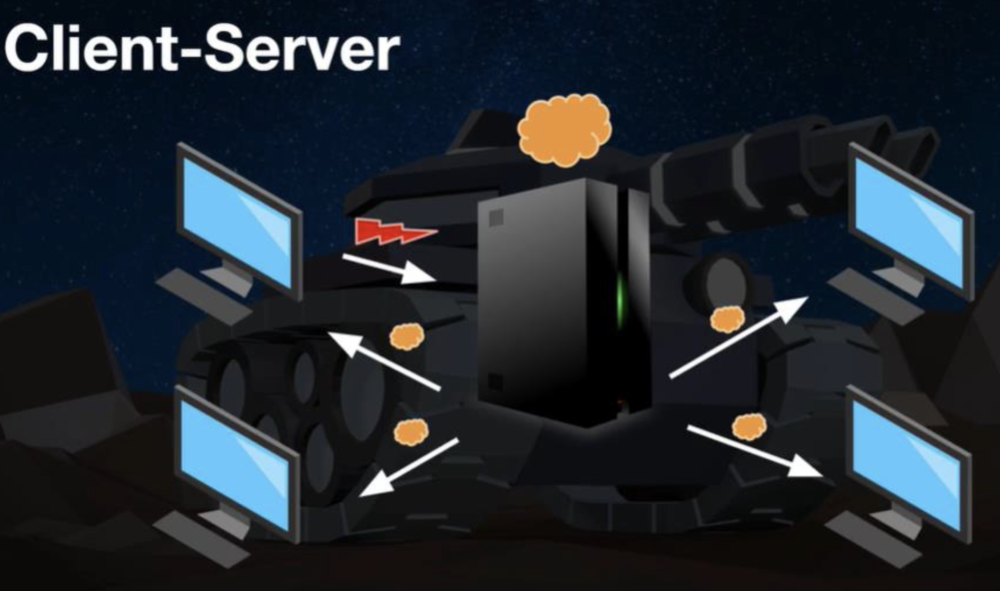
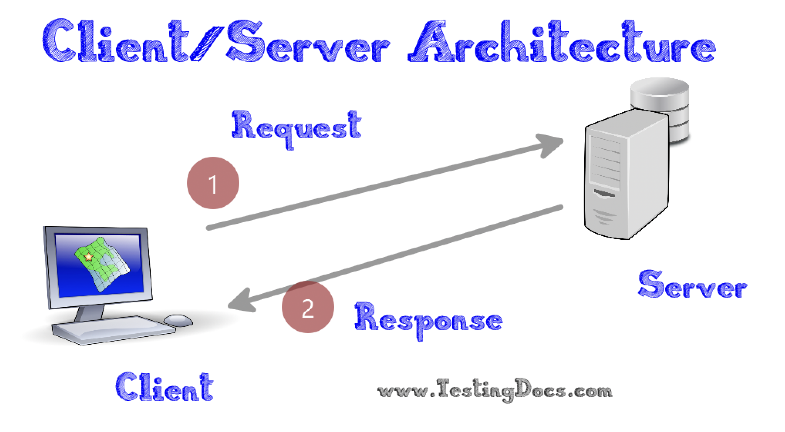
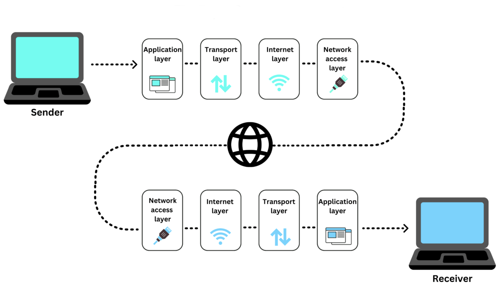

# Netværksøvelser del 1: netværk, sockets og TCP/IP

[Tilbage til overblik](README.md)

## Opgave 1: Hvad er en socket i Java?

1.1 Definer hvad en socket er i Java.

1.2 Hvilken protokol anvendes i forbindelse med kommunikation gennem ServerSocket?

1.3 Hvad er UDP, og hvad bruges UDP normalt til? Hvis vi vil anvende UDP, hvad gør man så i Java?

1.4 Hvis du skulle lave en chat-server. Hvilken protokol ville du så bruge - og hvorfor?

## Opgave 2: Klient/server princippet

Disse to figurer viser begge et klient/server scenario.

2.1 Hvad er den primære forskel?

2.2 Hvilken af de to nedenstående figurer tror du bedst beskriver en webserver og hvilken en server til et online spil? Og hvorfor? Forestil at begge figurer illustrer et enkelt request fra en klient.

### Case 1

### Case 2

## Opgave 3: Netværks-trafik (lagdeling)

Hvordan skal denne model forstås? Prøv at forklare modellen hvis vi antager at der sendes et http request afsted. Modellen kaldes ofte for "The Internet Protocol Suite" eller for "TCP/IP modellen".

## Opgave 4: IP adresser, DNS og porte

4.1 Find din egen laptops interne IP adresse. Dvs, det IP nummer du har på vores LAN. Hvordan gør man det? Det afhænger lidt af om du har Windows, OSX eller Linux.

4.2 Hvad hedder dit eksterne IP nummer. Dvs, det IP du har udefra internettet. Hint: brug fx. [https://www.myip.com/](https://www.myip.com/)

4.3 Hvorfor er der forskel på de to IP numre?

4.4 Find IP nummmeret på Cphbusiness' webserver: [https://www.cphbusiness.dk/](https://www.cphbusiness.dk/)

4.5 Hvad er IP nummeret på din DNS server - og hvad er det nu DNS er?

4.6 Hvilken port kører http normalt på?

4.7 Hvilken port kører https på?

4.8 Hvad er forskellen på http og https?

## Opgave 5: Kodeøvelse - NetworkDemos - Clone repository

5.1 Hop ned i en folder, hvor du vil lægge ugens demokode.

5.2 Klon vores øvelsesrepository [networkdemo](https://github.com/jonbertelsen/networkdemo/).

5.3 Åbn projektet i IntelliJ og spænd hjelmen.

5.4 Skim igennem README filen og dan dig et overblik.

5.5 Kør alle unit-tests på en gang.

## Opgave 6: Kør demo 01: SimpleClient og SimpleServer

6.1 Fold package ved navn `demo01_singlerequest` ud og åbn de to klasser

6.2 Kør først main metoden i `SimpleServer`

6.3 Kør dernæst main metoden i `SimpleClient`

6.4 Hvad sker der?

6.5 Kig koden igennem og prøv at forstå hvad der foregår. Kan du beskrive det med egne ord? Kig evt. i README.md filen og få inspiration.

6.6 Prøv også at køre demo 01 via den tilhørende unit-test.

## Opgave 7: Udvid demo 01

7.1 Lav `SimpleServer` lidt om, så den sender dags dato og tid retur til klienten.

7.2. Bonus øvelse: tjek tiden på dagen, så send en lille besked afsted, der angiver om det er formiddag, eftermiddag, aften eller nat. F.eks. som: "Hej - god morgen, kl. er nu 09:45 og dags dato er
2024-02-06".

## Opgave 8: Kør demo 02: EchoClient og EchoServer

8.1 Fold package ved navn `demo02_multiplerequests` ud og åbne de to klasser

8.2 Kør først main metoden i `EchoServer`

8.3 Kør dernæst main metoden i `EchoClient`

8.4 Hvad sker der?

8.5 Kig koden igennem og prøv at forstå hvad der foregår. Kan du beskrive det med egne ord? Kig evt. i README.md filen og få inspiration.

## Opgave 9: Udvid demo 02

9.1 Udvid `EchoClient`, så du kan indtaste beskeder fra tastaturet, som bliver sendt til serveren hver kan du taster **Retur**. Brug et `Scanner` objekt, som du kender fra 1. semester. På den måde kan vi sende så mange beskeder vi ønsker.

9.2 Bonus: Udvid `EchoServer`, så den tilføjer lidt citater til din tekst. Brug f.eks. `Random` til at variere teksterne lidt.

## Opgave 10: Kommuniker på tværs af maskiner

10.1 Gå sammen to og to. Person A finder sit lokale IP nummer og deler det med person B.

10.2 Person A starter EchoServer op på sin maskine.

10.3 Person B indtaster person A's IP nummer i sin EchoClient og starter den op. Nu skulle B gerne kunne sende beskeder til A.

10.4 Prøv at bytte roller.

10.5 Bonusøvelse: Lav også en Scanner på `EchoServer`, så serveren
kan sende beskeder tilbage til klienten. Det er nok det mest primitive chat-scenarie man kan forestille sig, men alligevel. Det er en god start.

[Tilbage til overblik](README.md)
