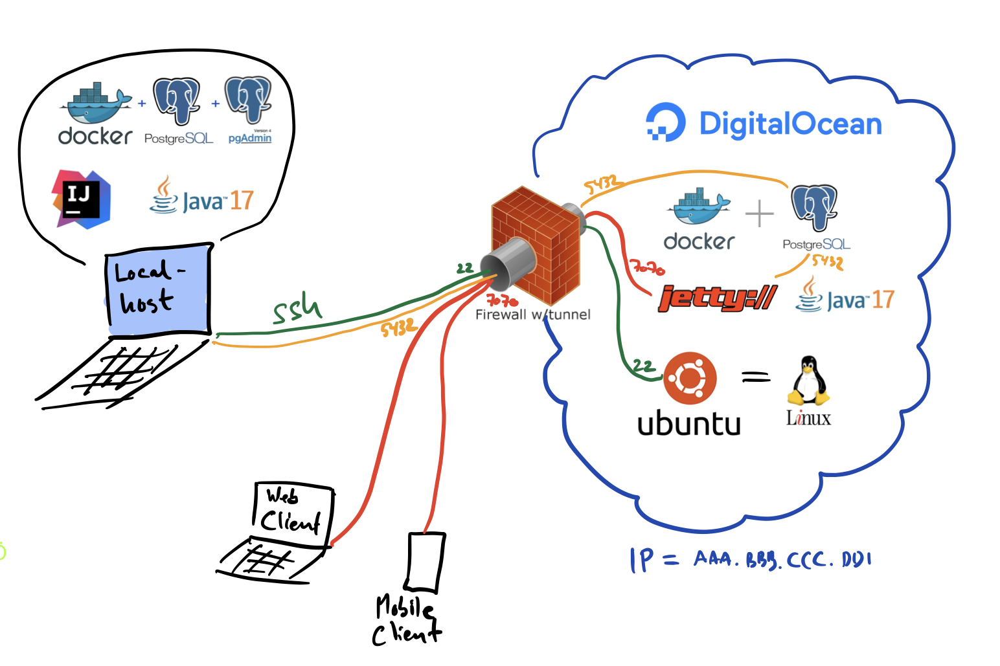

# Opsætning af virtuelt miljø i "skyen" til deployment

1. [Opret (eller find din) ssh nøgle](./sshkeys.md)
2. [Opsætning af virtuel server hos Digital Ocean](./droplet.md)
3. [Log på Droplet første gang](./logpaadroplet.md)
4. [Opret ny bruger i Ubuntu og konfigurer en firewall](./ubuntufix.md)
5. [Installation af Java 17 på Droplet](./java.md)
6. [Installation af Postgres 16.2 i en Docker container](./postgres_setup.md)
7. [Tag et snapshot af din Droplet](./snapshot.md)
8. [Deploy dit website](./deployment.md)

Her er en oversigt over den overordnede system arkitektur:

