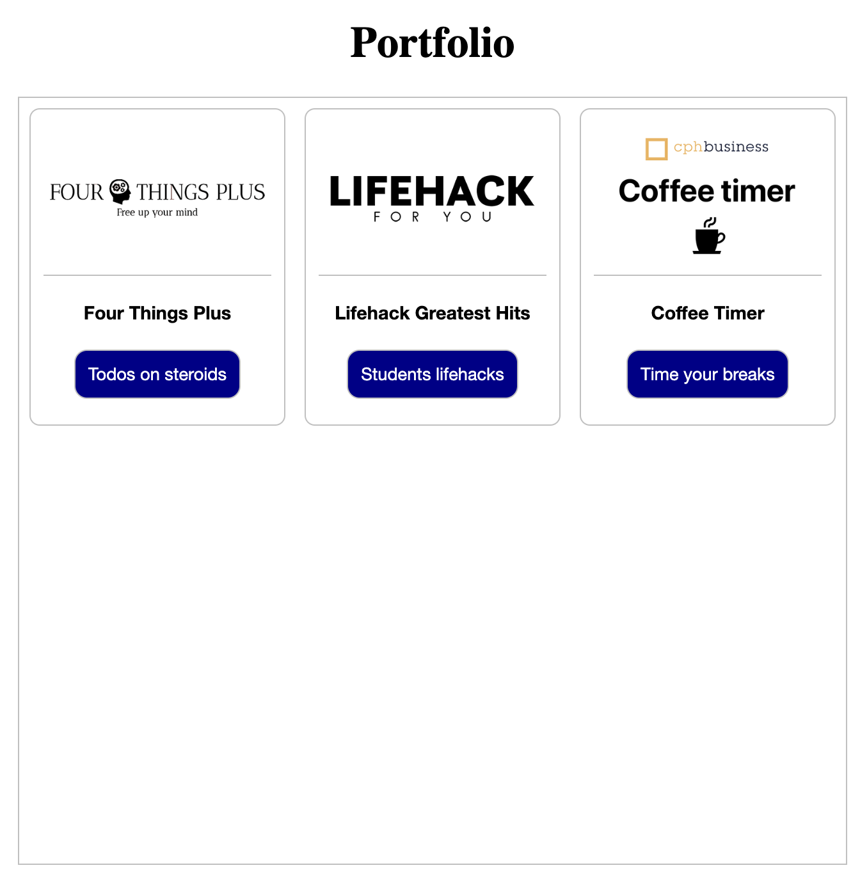

# Create static pages for your portfolio website

The site will be served by Caddy on the main domain name. The Javalin webapps will be served on  subdomains. This is setup in the Caddyfile that we configured previously in step 7 in the [deployment guide](./deployment_red.md).

## Portfolio page

It's a simple design, responsive though, and will look like this:



## Setup

Switch into the `~jetty/deployment/site` folder, and use nano to edit the static files. First we create an `index.html` file:

```bash
cd ~jetty/deployment
mkdir site
cd site
nano index.html
```

Then insert some html code. You can use the following:

```html
<!DOCTYPE html>
<html lang="en">

<head>
    <meta charset="UTF-8">
    <meta name="viewport" content="width=device-width, initial-scale=1.0">
    <link href="css/styles.css" rel="stylesheet" />
    <title>Portfolio</title>
</head>

  <body>
      <h1>Portfolio</h1>
      <div class="page">
          <div class="projects">
              <div class="cards">
                  <div class="card">
                      
                      <div class="card-copy">Four Things Plus</div>
                      <a class="card-link" href="https://fourthings.jonbertelsen.dk" />Todos on steroids</a>
                  </div>
              </div>
          </div>
      </div>
  </body>

</html>
```

The only you need to change is the link to the Javalin webapp. Swap `fourthings.jonbertelsen.dk` to your own domain name.

Then create a `css` folder and a `styles.css` file:

```bash
mkdir css
cd css
nano styles.css
```

Insert the following css code:

```css
html * {
    box-sizing: border-box;
}

body {
    display: flex;
    flex-direction: column;
    align-items: center;
}

.page {
    display: flex;
    flex-direction: column;
    align-items: center;
    width: 800px;
    padding:8px;
    border: 1px solid silver;
    min-height: 600px;
    gap:10px;
}

h1 {
    font-size: 2.125rem;
}

h2 {
   font-size: 1.875rem;
}

h3 {
    font-size: 1.5rem;
}

.projects {
    display: flex;
    flex-direction: column;
    align-items: center;
}

.cards {
    display: flex;
    flex-direction: row;
    flex-wrap: wrap;
    gap: 15px;
    justify-content: center;
}

.card {
    display: flex;
    flex-direction: column;
    min-width:100px;
    max-width:200px;
    align-items: center;
    gap: 10px;
    border: 1px solid silver;
    border-radius: 8px;
    padding: 10px;
}

.card-image {
    width: 100%;
    height: auto;
    border-radius: 8px 8px 0px 0px;
    border-bottom: 1px solid silver;
    padding:5px;
}

.card-link {
    font-family: "Helvetica Neue";
    padding: 10px;
    font-size: 0.85rem;
    color: white;
    border: solid 1px silver;
    text-decoration: none;
    background-color: darkblue;
    margin-bottom: 10px;
    border-radius: 10px;
}

.card-link:hover {
    background-color: #2566ac;
}

.card-copy {
    font-family: "Helvetica Neue";
    padding: 10px;
    font-size: 0.8rem;
    font-weight: bold;
}

@media (max-width: 450px) {
    .card {
        min-width: 100px;
        max-width: 150px;
    }
}
```

As the last thing, create an `images` folder and download the fourthings logo into the folder. This can be done in many ways, but here we use `curl`:

```bash
mkdir images
cd images
curl -O https://raw.githubusercontent.com/dat2Cph/caddy_deployment/main/site/images/fourthingsplus.png
ls
```

When we spin up the docker containers, the static page will be served by Caddy on the main domain name. The Javalin webapp will be served on the subdomain. This is setup in the Caddyfile that we configured previously in step 7 in the deployment guide.
