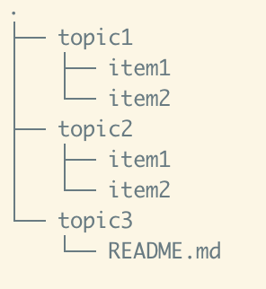

# Day 1 Class exercise
1. Log on to droplet via ssh and the username you have created (jetty)
2. Create this folder structure:

- By using the following commands: `mkdir` and `touch`
3. Open the README file with nano editor and write a short description of the content of the folder structure. Save and exit.
4. Create a README.md file locally on you laptop and copy it to the droplet using `scp`. The README.md should contain some text.
5. On the froplet print the content of the new README.md file to the console using `cat`.