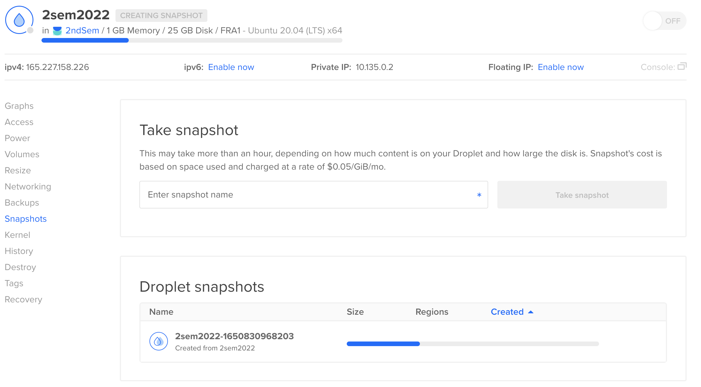

# Tag et snapshot

Når du har installeret din Droplet og alt ser ud til at virke, er det et perfekt tidspunkt at tage et såkaldt "snapshot". Hvis din Droplet fejler, eller noget går galt, kan du altid geninstallere en identisk kopi fra et snapshot. Du skal slukke for din droplet for at igangsætte et snapshot. Se herunder hvor det gøres:

Hvis du ikke kan finde snapshop menuen, så er det nok fordi du mangler at klikke på din droplet først.

Du bliver også bedt om at slutte for din Droplet. Det gøres på samme side - øverst til højre.

Det tager nogle minutter før dit snapshot er klart. Så kan du starte din Droplet bagefter og logge ind igen.

Det koster lidt håndører at have et snapshot liggende, så det er en god idé at slette det igen, når du ikke har brug for det længere. Fx efter eksamen. Det tager heller ikke så lang tid at oprette en ny Droplet fra bunden, så hvis du vil spare de penge, så slet det igen. Men du burde kunne køre et år gratis hos Digital Ocean med den voucher du kan få fra GitHub Education, så tag bare spenderbukserne på.

## Videre herfra

- [Næste trin](./deployment_red.md)
- [Hop tilbage til oversigten](./README.md)
