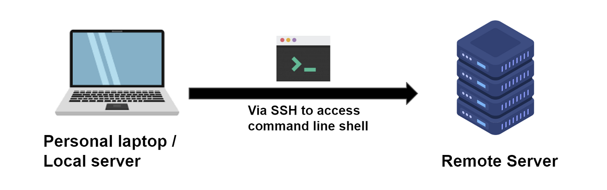

# Opret (eller find din) ssh nøgle

Når vi skal udføre kommandoer på vores Droplet gøres det gennem en terminal. I Windows bruges Git-Bash, på en Mac bruges terminalvinduet.

Vi logger ind på Dropletten via ssh. Det er samme krypteringsnøgle vi bruger på GitHub.



Check om du har en ssh-nøgle liggende allerede:

I terminalen:

Hvis du allerede har en ssh-nøgle liggende, så kan du gå videre til næste lektion. Hvis ikke så tjek om du har en nøgle liggende i folderen `~/.ssh`. Tegnet `~` hedder `tilde` og er et symbol i Linux for din hjemmefolder. Så vi indholdet af folderen således:

```bash
cd ~/.ssh
ls
```

Hvis du allerede har et sæt ssh-nøgler, så ligger der (mindst) to filer med navnene:

`id_rsa` og `id_rsa.pub`

Den første er din private genpart af nøglen og den anden den offentlige. Det er den offentlige som vi skal bruge, når vi opretter vores Droplet hos Digital Ocean.

Hvis du allerede har nøglerne liggende, så kan du gå videre til næste lektion. Ellers skal du lige oprette et nøglesæt. Det gøres således:

```bash
ssh-keygen
```

Herefter trykker du bare [return] indtil nøglerne er lavet. Du skal ikke oprette et kodeord. Det gør det bare mere besværligt hver gang du skal bruge nøglen.

Tjek lige at du har fået nøglerne oprettet:

```bash
ls
```

Hvis du hører til den tjekkede type, så lav en kopi af dine to nøglefiler på en USB-stick. Så har du en backup - og du kan også overføre dem til en stationær maskine etc.

## Videre herfra

- [Næste trin](./droplet.md)
- [Hop tilbage til oversigten](./README.md)
