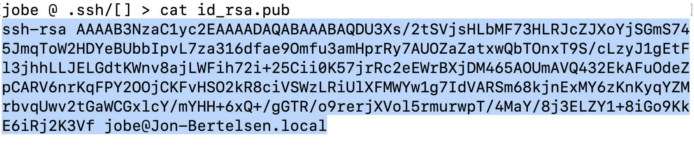

# Opret ny bruger i Ubuntu og konfigurer en firewall

## Lav en ekstra bruger (som ikke er root)

Ideen med dette er at have en user, som ikke har gude-agtige beføjelser som `root`. Altså af sikkerhedsmæssige grunde.

### 1. Log på din Droplet via ssh

```bash
ssh root@ip
```

### 2. Opret user (vi kalder den for jetty)

Tast et sikkert password og gem det godt:

```bash
adduser jetty 
```

Tilføj jetty-brugeren til `sudo` gruppen for at kunne få adgang til alle rettigheder når det er nødvendigt:

```bash
usermod -aG sudo jetty
```

Tjek hvad du har fået oprettet (userinfo):

```bash
id jetty
```

Tjek om du kan logge ind som jetty med root rettigheder. Du skal taste dit jetty kodeord når prompten beder om det:

```bash
sudo su jetty 
```

Skift til hjemmefolderen for jetty brugeren:

```bash
cd ~jetty
```

### 3. Fix ssh key

I det følgende skal vi sørge for jetty-brugeren kan logge på via ssh. Dvs, at vi skal oprette en offentlig ssh-nøgle, og sørge for at diverse rettigheder giver adgang til at læse filen, men heller ikke efterlader systemet for åbent:

Først skal vi oprette en `.ssh` folder i vores hjemmefolder for jetty-brugeren:

```bash
cd ~
mkdir .ssh
ls -la
```

Den sidste kommando viser indholdet i hjemmefolderen inkl. skjulte filer og foldere.

Nu skal vi tildele `.ssh` folderen passende rettigheder - og bagefter se resultatet:

```bash
chmod 700 .ssh
ls -la
```

Hop ned i `.ssh` folderen og opret en fil ved navn `authorized_keys` ved hjælp af `nano`:

```bash
cd .ssh
nano authorized_keys
```

Kopier din public key (fra lokal `.ssh` folder). Den ser nogenlunde således ud:



Vær omhyggelig med KUN at kopiere nøglen - og undgå at få blanktegn med. Når du kopierer og indsætter, så højre-klik med musen og vælg "kopier/indsæt" i stedet for at bruge hot-keys. De virker ikke altid som forventet i terminalen.

Gem filen i nano editor (`ctrl + X -> Y -> enter`)

### 4. Sæt access level til nøglefilen

```bash
chmod 600 authorized_keys
```

Nu kan du logge på med `ssh jetty@ip` i stedet for root.

Log ud og log på med `jetty` brugeren:

```bash
exit
exit
```

Det første exit logger af som jetty-bruger og går tilbage til root. Det næste exit logger root-brugeren af din VM.

Når du er tilbage i din lokale terminal, så logger du på som `jetty`:

```bash
ssh jetty@ip
```

Hvis det går godt, så læg mærke til at prompten hedder noget i stil med `jetty@dropletnavn:~$`

### 5. Login fra localhost

Fremover kan du logge på din Droplet via den nyligt oprettede `jetty` bruger:

```bash
ssh jetty@ip
```

### 6. Opsætning af firewall

For at sikre vores installation, så vil vi opsætte en firewall. Det er specielt Postgres, som er sårbar for angreb, hvis den er åben for alle. Vi anvender Digital Ocean's firewall, som er en del af deres tjeneste.

- [Følg denne video tutorial for at holde skidtet fra døren](https://cphbusiness.cloud.panopto.eu/Panopto/Pages/Viewer.aspx?id=b2178213-1924-4325-85c6-b15a00aba65e)

## Videre herfra

- [Næste trin](./java.md)
- [Hop tilbage til oversigten](./README.md)
