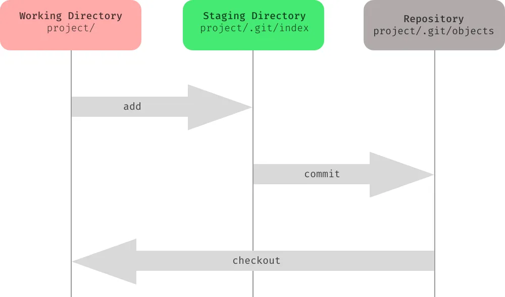

# Git Overview

## Topics

### Introduction to Version Control and Git Basics

Version control is a system that records changes to a file or set of files over time, allowing you to recall specific versions later. It is commonly used in software development but can be applied to any files that undergo changes over time. The primary purpose of version control is to facilitate collaboration among multiple contributors, keep track of changes, and provide mechanisms to revert to previous states if needed.

1. **History Tracking:**
   - Version control systems (VCS) keep a historical record of changes made to files. Each change is associated with a timestamp, author, and a unique identifier.

2. **Collaboration:**
   - Multiple developers can work on the same project simultaneously. Version control helps manage and merge their changes, preventing conflicts and ensuring a coherent codebase.

3. **Branching and Merging:**
   - Version control systems allow developers to create branches, which are independent lines of development. Branches can be merged back into the main codebase, enabling parallel development of features or bug fixes.

4. **Reverting Changes:**
   - If a mistake is made or an undesirable change is introduced, version control allows developers to revert to a previous state easily. This is crucial for maintaining a stable and functional codebase.

5. **Traceability:**
   - Each change is associated with a commit message, providing a concise description of the modifications made. This aids in understanding the purpose and context of each change.

6. **Backup and Recovery:**
   - Version control serves as a form of backup. Even if a local copy of the code is lost or corrupted, the entire project's history can be reconstructed from the central repository.

7. **Code Reviews:**
   - Version control facilitates code reviews by allowing team members to view and comment on proposed changes before they are merged into the main codebase.

8. **Distributed Version Control:**
   - Many modern version control systems, like Git and Mercurial, are distributed. This means that every developer has a complete copy of the project's history, providing redundancy and flexibility.

One of the most widely used version control systems is Git, which is known for its speed, flexibility, and distributed nature. Other version control systems include Subversion (SVN), Mercurial, and Perforce.

### Important Git Concepts


1. **Repository:** or **repo** or **working tree**, is a collection of files and folders that are tracked by a version control system. Each repository contains the entire history of changes to its files, along with metadata such as the author of each commit and the commit message. Repositories can be local (i.e., stored on your computer) or remote (i.e., stored on a server like github.com).
2. **Commit:** is a snapshot of a repository's files at a specific point in time. Commits are created by the user to record changes to the repository. Each commit is associated with a commit message, which describes the changes made. Commits are the building blocks of Git repositories.
3. **Branch:** is an independent line of development. Branches allow users to work on a project simultaneously without affecting the main codebase. Changes made in one branch can be merged into another branch. The main branch is usually called master or main.
4. **Merge:** is the process of combining two branches. Merging is usually done to incorporate changes made in one branch into another branch. For example, a feature branch can be merged into the main branch once the feature is complete or when pulling changes from a remote repository and those changes needs to be incorporated into the local repository.
5. **Working Directory:** is the directory on your computer where you are currently working. It contains the files and folders that you are modifying. When you clone a repository, the working directory is the repository's local copy on your computer.
6. **Staging Area:** or **index** is a temporary storage area where files are stored before being committed to the repository. Files in the staging area are not tracked by Git yet. They are only added to the staging area when you run the git add command.
7. **Remote:** is a repository that is stored on a server (`git remote show origin` will show upstream url for the repo). Remote repositories can be accessed by multiple users, allowing them to collaborate. Changes made to a remote repository can be pulled and merged into a local repository, and vice versa.

### Most important skills



1. **Initalizing a Git repository**

- `git init`: initializes a new Git repository (by creating the .git folder) in the current directory. This command is used to start tracking changes in an existing project or to initialize a new, empty repository.

2. Checking the **status** of the repository

- `git status`: shows the current status of the repository

3. **Adding files** to the staging area

- `git add <filename>`: adds a file to the staging area (i.e., prepares it to be committed) or `git add .`: adds all files in the **current directory** to the staging area.`,

4. **Committing changes**

- `git commit -m "commit message"`: commits the staged changes to the local repository
- Most **common command sequence**: `git status` to see if everything looks right and what files are affected by the upcomming commit, then `git add .`, `git commit -m "commit message"` and `git push` to push the changes to the remote repository.

5. Git **ignore** files

- `.gitignore`: is a text file that tells Git which files or folders to ignore in a project. It is used to avoid committing transient files, build artifacts, and machine-specific settings that are not relevant to the project.
- `.gitignore` files are usually committed to the repository and shared with other developers.
- [gitignore.io](gitignore.io) is a useful tool for generating `.gitignore` files for different types of projects.
- If you want to ignore a file that is already tracked by Git, you need to untrack it first: `git rm --cached <filename>` or you can move the file or folder outside the working tree, add and commit and then move it back in.

6. Viewing the **commit history**

- `git log`: shows the commit history or `git` or `$ git log --graph --all --pretty=format:'%Cred%h%Creset -%C(yellow)%d%Creset %s %Cgreen(%cr) %C(bold blue)<%an>%Creset' --abbrev-commit`: shows a compact commit history. (This command is too long to remember, so it's a good idea to create an alias for it: `git config --global alias.logline "log --graph --all --pretty=format:'%Cred%h%Creset -%C(yellow)%d%Creset %s %Cgreen(%cr) %C(bold blue)<%an>%Creset' --abbrev-commit"` and then calling it with `git logline` afterwards.)

7. Viewing and comparing changes with `git diff`

- `git diff`: shows the changes made to the files since the last commit
- `git diff <filename>`: shows the changes made to a specific file since the last commit
- `git diff <commit hash> <filename>`: shows the changes made to a specific file since a specified previous commit
- `git diff <branchname>`: shows the changes made to the files in the current branch since the specified branch

8. Checking out previous versions of files

- `git checkout <branch or commit hash> <filename>`: checks out a file from a previous commit or a branch

9. Creating and switching branches

- `git checkout -b <branchname>`: creates a new branch and checks it out or `git branch <branchname>`: creates a new branch whereas `git checkout <branchname>`: checks out an existing branch

10. Merging branches

- `git merge <branchname>`: merges a branch into the current branch (Stop and think if you are in the right branch before merging!)

11. Resolving merge conflicts

- Open the file in your text editor and resolve the conflicts manually. Then, add and commit the changes.
- Alternatively, you can abort the merge with `git merge --abort` and start over.
- Or use vs code or intellij to resolve the conflicts.
- Or abort the merge and use `git pull -X theirs` to use the remote version of the conflicting files.
- Or `git checkout --theirs path/to/file` or `git checkout --ours path/to/file` to use the local version of the conflicting files.

12. Cloning repositories

- `git clone <url>`: clones a remote repository into a new directory

13. Pushing and pulling changes

- `git push`: pushes changes from a local repository to a remote repository
- `git pull`: pulls changes from a remote repository into a local repository (This command is equivalent to `git fetch` followed by `git merge`.)

14. Pull Requests (PR)

- A pull request is a feature that allows developers to propose changes to a repository. Other developers can review the proposed changes, discuss potential modifications, and even push follow-up commits if necessary. Once the changes are approved, the pull request can be merged into the repository.
- Pull requests can only be opened between two branches that are different (i.e., have at least one commit that is not in the other branch) or between a repository and a fork.
- Folow these [6 steps](https://docs.github.com/en/pull-requests/collaborating-with-pull-requests/proposing-changes-to-your-work-with-pull-requests/creating-a-pull-request#creating-the-pull-request) to create a pull request.

15. Undoing changes with reset, revert and restore

- **Make a copy of entire repo before doing these operations**. Especially untill you know what you are doing!
- `reset`: **Changes git history**. Use with caution! and never when changes are pushed to github, `revert`: Does not change git history. It is about making a new commit, that makes changes to old commits. Use this if you have already pushed your changes to a remote repository!, `restore`: . restore a file from a previous commit!
- **change a wrong commit message**: `git commit --amend -m "New commit message"` will change the last commit message.
- **revert commits** but **keep staged changes**: `git reset --soft HEAD~3`: reverts the last 3 commits and puts the changes in the staging area.
- remove commits and delete changes (**Dangerous**) `git reset --hard HEAD~3` removes the last 3 commits and discards the changes.
- remove commits and unstage changes `git reset --mixed HEAD~3`: reverts the last 3 commits and discards the changes from staged area but **keeps** the changes in the working directory.
- revert a commit: `git revert <commit hash>`: creates a new commit that undoes the changes made in the specified commit
- remove changes to working tree since last commit: `git stash`: temporarily stores all modified tracked files and leave working tree clean (as it were when you last committed)
- restore a file from a previous commit: `git restore --source <commit hash> <filename>`: restores the specified file from the specified commit
- remove files from staging area: `git restore --staged .` or `git reset HEAD -- .` where dot is the current directory, but we can specify any path.

16. **Rebasing** vs. **merging** vs. **cherry-picking**

- Rebasing is the process of moving or combining a sequence of commits to a new base commit. Rebasing is most useful and easily visualized in the context of a feature branching workflow. The general process can be visualized as "moving the base of a branch onto a different point".
  - `git rebase <branchname>`: rebases the current branch onto another branch
  - `git rebase -i <branchname>`: rebases the current branch onto another branch and allows you to interactively reword, edit, delete, and squash commits
- Cherry-picking is the process of applying a commit from one branch to another. It is useful for picking a single commit from a branch and applying it to another branch.
  - `git cherry-pick <commit hash>`: applies the changes made in the specified commit to the current branch
- Merging is the process of combining two branches. Merging is usually done to incorporate changes made in one branch into another branch. For example, a feature branch can be merged into the main branch once the feature is complete.
  - `git merge <branchname>`: merges a branch into the current branch

17. Stashing changes

- purpose: temporarily store changes that you don't want to commit immediately
- `git stash`: temporarily stores all modified tracked files
- `git stash pop`: applies the most recently stashed changes to the working directory
- `git stash list`: lists all stashed changesets

18. Making a branch from a previous commit (useful when you want access to a previous version of the code)

- `git branch <branchname> <commit hash>`: creates a new branch from a previous commit

### Dos and Don'ts

1. **Commit often, push often**
   - Commit your changes often and push them to the remote repository frequently. This will help you keep track of your progress and avoid losing your work.
2. **Write descriptive commit messages**
    - Write clear and concise commit messages that describe the changes you made. This will help you and your team members understand the purpose and context of each change.
1. **Never change the history of a public repository**
   - If you are working on a public repository, never change the history of the repository. This will cause problems for anyone who has cloned the repository. Instead, create a new commit that undoes the changes.
2. **Always commit changes before restoring an old version**
   - If you want to restore an old version of a file, commit your changes first. This will allow you to revert to the current version if needed.
3. **Use branches**
    - Use branches to work on features or bug fixes independently. This will allow you to work on multiple features simultaneously without affecting the main codebase.
4. **Pull before you push**
    - Always pull the latest changes from the remote repository before working on shared files and pushing your commits. This will help you avoid (most) merge conflicts.
5. **Review your changes**
    - Review your changes before committing them (`git status`). This will help you catch mistakes, write all-inclusive commit messages and avoid committing unnecessary changes.

### Installing Git

### Configuring Git

Configuring Git involves setting up various parameters to personalize your Git environment. Here are the essential configuration steps:

### 1. **Setting Your Name and Email:**

- Open a terminal or command prompt.
- Set your Git username: ` git config --global user.name "Your Name" `
- Set your Git email: ` git config --global user.email "your.email@example.com" `

### 2. **Configuring Text Editor:**

- Choose a text editor for Git. If you haven't set up a default text editor, Git might use the system default. To set a specific text editor (e.g., VSCode), use: ` git config --global core.editor "code --wait" `
- Check your current text editor: `git config -e` or `git config --global -e` will open the global config file in your default text editor.

### 3. **Checking Configuration:**

- To check your current Git configuration, you can use: ` git config --list `

### 4. **Setting Line Endings:**

- Configure line endings to prevent cross-platform issues. For Windows, you might want to set: ` git config --global core.autocrlf true `
     For Unix-like systems: ` git config --global core.autocrlf input `

### 5. **Setting Default Branch Name:**

- If you want to change the default branch name from "master" to something else (e.g., "main"): ` git config --global init.defaultBranch main `

### 6. **Credential Caching:**

- Follow this [guide](https://statistics.berkeley.edu/computing/faqs/git-auth) (just the https part)
- Configure Git to remember your credentials for a certain period: ` git config --global credential.helper cache `

### 7. **Customizing Output Format:**

- Customize the output format of Git commands for better readability: ` git config --global alias.lg "log --graph --pretty=format:'%Cred%h%Creset -%C(yellow)%d%Creset %s %Cgreen(%cr) %C(bold blue)<%an>%Creset' --abbrev-commit --date=relative" `

### 8. **Setting Up SSH Keys:**

- If you plan to use SSH for authentication with remote repositories, generate and add your SSH key to your SSH agent:

     ```bash
     ssh-keygen -t rsa -b 4096 -C "your.email@example.com"
     eval "$(ssh-agent -s)"
     ssh-add ~/.ssh/id_rsa
     ```
