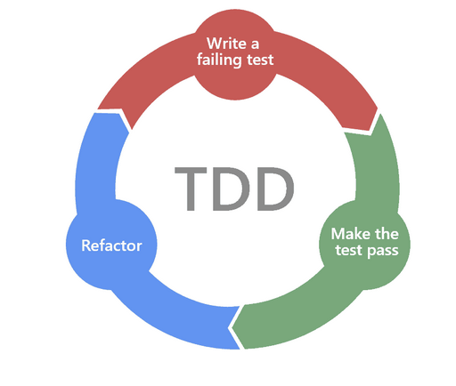

# Test Driven Development (TDD)

{: width="300px"}

Purpose of TDD is to write tests before writing code. This is a good way to ensure that the code is testable and that the code is written in small increments and that the code is written to solve the problem and not more.

## Class exercise: Test Driven Development

- The purpose of this exercise is to train yourself in the art of TDD.
- It is not easy to do so practise it as often as you can.

1. Open up your IDE and create a new maven project: `tdd-koans`
2. Create a test class (That's right we start by creating the test NOT the source code)
3. In the test class create a test for the first of the 8 requirements found [here](https://github.com/testdouble/contributing-tests/wiki/Greeting-Kata)
4. Whenever you write a new test, create the classes and methods needed for your test class to compile (Let your IDE auto create them with no implementation).
5. Run the test and see that it fails.
6. Implement the minimum necessary functionality in your java method, so that the test no longer fails.
7. Run the test again to see that it is green.
8. Refactor your code if necessary to achieve:

- Better readability and maintainability
- Elimanation of code duplication
- Better performance
- Refactoring involves making changes to the code to improve its internal structure without altering its external behavior.

9. Repeat steps 3-8 for each of the 8 requirements.

- Hint for requirement 4: Use `Object` type for the parameter and `if(o instanceof String)` and `if(o instanceof String[])`
- Hint: Add the following section to your Pom.xml file to enable JUnit 5:

```xml
<build>
    <plugins>
        <plugin>
            <groupId>org.apache.maven.plugins</groupId>
            <artifactId>maven-surefire-plugin</artifactId>
            <version>3.0.0</version>
        </plugin>
    </plugins>
</build>
```

and these 2 dependencies:

```xml
<dependency>
    <groupId>org.junit.jupiter</groupId>
    <artifactId>junit-jupiter-api</artifactId>
    <version>5.10.0</version>
    <scope>test</scope>
</dependency>
<dependency>
    <groupId>org.junit.jupiter</groupId>
    <artifactId>junit-jupiter-engine</artifactId>
    <version>5.10.0</version>
    <scope>test</scope>
</dependency>
```

- When you have successfully written test cases for all 8 requirements and implemented the necessary source code (same ONE method for all requirements) reflect on this exercise compared to how you have been writing code previously. Do you see any benefits in doing it this way? Do you see any down sides?

- For more practise exercises look [here](https://osherove.com/tdd-kata-1/)
