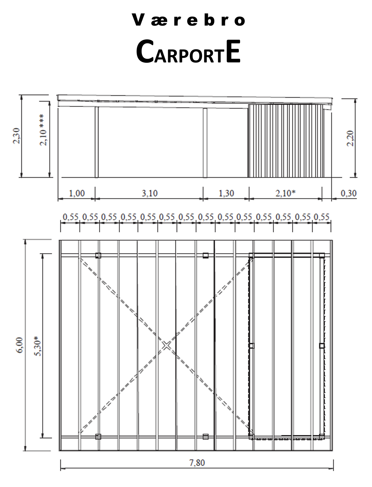

## Carport projekt - inpiration og hjælp til opgaven

Selve oplægget til eksamensopgaven finder du på Moodle i det sidste flow. På denne side kan du finde en række ekstra materialer og lidt tips og tricks til opgaven.

## Styklisteberegner

Når I skal beregne de enkelte rækker i styklisten, er det en god idé, at I begynder med stolper, remme og spær. Det er også en fordel, at lave unit-tests undervejs. Det gør blandt andet, at I ikke behøver at køre web-applikation hver gang I afprøver en beregning. I stedet kan I bare køre en unit-test. Se mere nedenfor.

- Her er et par videoer med lidt [tips og tricks til beregningerne](https://cphbusiness.cloud.panopto.eu/Panopto/Pages/Sessions/List.aspx?folderID=5687833b-ab7c-4768-a7cb-b1680130b164). Både generelle overvejelser og lidt Java skitser.

## Unittest (af styklisteberegner)

Når I skal teste om jeres beregninger fungerer, vil det være oplagt at lave unit-tests på metoderne. Det kræver at metoderne er skrevet, så de returnerer noget enkelt. F.eks. en integer (antal stolper etc).

- Her er [den teori vi bruger på 2. semester](../../toolbox/test/testteori.md) angående unit-tests og tests i det hele taget. Godt at have styr på til eksamen.

- I videoen om [stylisteberegneren](https://cphbusiness.cloud.panopto.eu/Panopto/Pages/Sessions/List.aspx?folderID=5687833b-ab7c-4768-a7cb-b1680130b164) ses også hvordan I evt. kan sætte jeres tests op.

## Integrationstest (af database funktionalitet)

Når vi skal sikre at vores database-metoder (datamappers) fungerer, foregår det ved hjælp af en såkaldt integrationstest.

I behøver ikke at lave tests til alle mapper-metoder, men det vil være flot hvis I kan lave tests til et sæt CRUD metoder på en enkelt mapper. F.eks. `OrderMapper` etc.

Det vil give jer en fin fornemmelse af hvad der skal til for at kode en integrationstest.

- Her er en udførlig vejledning I kan følge til [opsætning af integrationstest](./integrationstest/README.md).

## Deling af database hos Digital Ocean

Hvis din gruppe anvender en delt database på en af jeres Droplets, så kan I se hvordan det sættes op her:

- [Fin-tuning af firewall](https://cphbusiness.cloud.panopto.eu/Panopto/Pages/Viewer.aspx?id=b2178213-1924-4325-85c6-b15a00aba65e). Her sætter vi en firewall op hos Digital Ocean, hvor vi sikrer adgangen til databasen kun kan ske for udvalgte IP-numre.

- [Brug af miljøvariabler](https://cphbusiness.cloud.panopto.eu/Panopto/Pages/Viewer.aspx?id=543c7e86-f0f7-44ff-93de-b161010f75d1) for at undgå at udstille jeres sikre kodeord.

## Deployment af website

Vi har tidligere på semestret sat en virtuel maskine op hos Digital Ocean.

- Her ligger vejledningerne til [opsætning og deployment](../../linux_and_deployment/README.md). Og specielt delen om [deployment](../../linux_and_deployment/deployment.md) er relevant når I skal lægge jeres carport-projekt på internettet.

- I kan også følge disse deployment videoer, hvis I tager den ["røde pille"](https://cphbusiness.cloud.panopto.eu/Panopto/Pages/Sessions/List.aspx?folderID=322ab819-f0ca-4fc4-8e76-b15600a65ecd).

## Afsendelse af emails fra Java

Hvis I skulle have brug for at afsende emails fra jeres system, så har I brug for en SMTP-server. Det kan håndteres på mange måder, men vi har lavet en guide, som får jer i gang med at sende professionelle mails i en ruf.

- [Mail kursus med SendGrid](./sendgrid/README.md)

## 2D SVG-tegninger af carporten

Når / hvis I skal tegne carporten får I brug for at arbejde med SVG. Vi har lavet et "selvstudie" hvor I kan lære at tegne løs fra start til slut. Det kan anbefales at gennemgå "selvstudiet" sammen. Evt. hele gruppen i fællesskab - eller 2 og 2. I skal nok regne med at det tager 3-4 timer før I er udlært og klar til at implementere jeres egen version i projektet.

- [SVG kursus](./svg/README.md)

