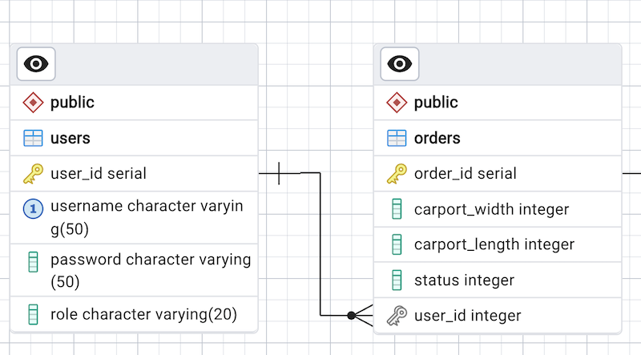

# Integrationstest

Når man bygger større systemer, vil man gerne sikre sig at ens datamappere virker. Så vi introducerer en metode til automatiseret test af vores database metoder - og som tjekker at der overhovedet er hul igennem til databasen. Det er en slags unit-test, men da den involverer flere delsystemer (Java og Postgres) kaldes det ofte for "Integrationstest".

## Hvad er en integrationstest?

Der er ingen klar definition på hvad en integrationstest er, men vi kan vende den om, og sige, at det er _ikke_ en unit test hvis (inspireret af Michael Feathers: _Working Effectively With Legacy Code_):

- den kommunikerer med databasen
- den kommunikerer over netværket
- den rører filsystemet
- den ikke kan køre samtidig med enhver af dine andre unit tests
- du har brug for at gøre specielle ting ved miljøet for at køre testen.

Der er med andre ord flere systemer i spil, som hver for sig kan (bør) være unit testede og nu vil vi gerne teste om de også kan køre sammen (integrerede).

## Principper for integrationstest med database

Normalt starter mapper metoder med at bede om en databaseforbindelse. Forbindelsen specificerer, hvilken database, der skal anvendes.

Idéen er at lave en _testdatabase_ (så vi ikke tester direkte på produktionsdatabasen), og give mapper’en en forbindelse til testdatabasen, som kan anvendes under test.

Dette involverer disse trin:

1. Opret en testdatabase
2. I testdatabasen oprettes de samme tabeller som i den oprindelige database. Dog uden data.
3. Gør det muligt for mapper’en at bruge en anden forbindelse (vha. dependency injection).
4. Før hver test fjernes alle rækker i testdatabasens tabeller så der startes på en frisk.
5. Når alle rækker er fjernet, indsættes et antal rækker i tabellerne, så man har fuldkommen styr på hvilke data, som ligger i testdatabasen før hver test køres.
6. Skriv test metoder
7. Kør dine test

## Sådan udfører vi en integrationstest på carport projektet

I det følgende koder vi en integrationstest på en del af et system.

### Forudsætninger

- I har et carportprojekt klar med de mest grundliggende metoder til bestilling af en carport.

- I har en datamapperklasse, som hedder `OrderMapper`. Den har fx. metoderne:

  ```java
   public static List<Order> getAllOrders(ConnectionPool connectionPool)
   public static Order getOrderById(int orderId, ConnectionPool connectionPool)
   public static Order insertOrder(Order order, ConnectionPool connectionPool)
   public static int deleteOrderById(int orderId, ConnectionPool connectionPool)
   public static Order updateOrderById(Order order, ConnectionPool connectionPool)
   ```

- Selve databasen hedder `carport` og den har skemaerne `public`, som alle kender, men også et ekstra skema vi selv opretter, som hedder `test`.

- Den del af databasen vi tester på ser således ud:

{: style="display: block; margin-left: auto; margin-right: auto; width: 500px; padding:20px;"}

Den er sikkert lidt forsimplet, men det er for at gøre eksemplet lettere at arbejde med.

- Vi antager at, gruppen har en fælles database, som ligger på IP = `aaa.bbb.ccc.ddd` og port nummer `5432`.

- Vi antager, at der er opsat en firewall på den Droplet databasen kører på, og at der er lavet huller til de IP numre, som gruppens medlemmer arbejder fra.

### Instruktioner

- [Se først denne generelle video om test](https://cphbusiness.cloud.panopto.eu/Panopto/Pages/Viewer.aspx?id=0e082e5d-69ee-4b9c-b1cc-b16c00c6d745). Den forklarer lidt om formålet med integrationstest set i sammenhæng med en række andre test-former.

- [Følg denne kode-video-tutorial](https://cphbusiness.cloud.panopto.eu/Panopto/Pages/Viewer.aspx?id=ec99d446-f586-4e42-9e2a-b16c00cebce5), hvor I bliver ledt gennem opsætning af integrationstesten fra A-Z.

Undervejs vil det være en fordel at kopiere fra den nedenstående GIST:

- [Eksempel på Integrationstest (GIST)](https://gist.github.com/jonbertelsen/7439bbfb0d943db8ebbe36d344bbf161)

- I får også brug for at tilpasse disse miljø-variabler:

   ```bash
   DEPLOYED=PROD;JDBC_CONNECTION_STRING=jdbc:postgresql://aaa.bbb.ccc.ddd:5432/%s?currentSchema=test;JDBC_DB=carport;JDBC_PASSWORD=indsæt_dit_eget;JDBC_USER=postgres
   ```

   I skal ændre IP (aaa.bbb.ccc.ddd) til at pege på jeres Droplet og så skal I indsætte jeres "hemmelige kodeord". Hvis I er i tvivl om hvad jeres "hemmelige kodeord" er, så skal I kigge på jeres Droplet i filen: `~jetty/2semDockerSetupRemote/docker-compose.yml`. Der finder I nøglen til kronjuvelerne a.k.a. Postgres.
