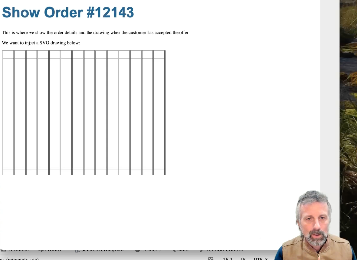

# Dynamiske SVG tegninger

## 0. Introduktion (specs)

Nu skal vi generere `SVG` fra Java. Hele ideen bygger på indsigten om at:

> `SVG` er en række af tegn - en tekst-streng, som opfylder `SVG` standarden.

Derfor skal vi lave en hjælpe-klasse i Java, hvor man kan bygge tekst-strengene op lidt ad gangen, og hvor man kan kalde de grundliggende `SVG` primitiver:

- `<svg>`
- `<line>`
- `<rectangle>`
- `<text>`
- `<defs>` og `<markers>` til pile

Man skal også kunne indsætte en `SVG`-tegning inden i en anden.

Det giver tilsammen følgende klasse-diagram:


Here is a little snippet you can copy from:

```java
public class Svg {
    private StringBuilder svg;

    public Svg(int x, int y, String viewBox, String width, String height){}
    public addRectangle(int x, int y, double height, double width, String style){}
    public addLine(int x1, int y1, int x2, int y2, String style){}
    public addArrow(int x1, int y1, int x2, int y2, String style){}
    public addText(int x, int y, int rotation, String text){}
    public addSvg(Svg innerSvg){}
    public toString(){}
}
```

I det følgende angiver vi en løsning til hvordan man i grove træk kan implementere `Svg`-klassen og hvordan man kan bygge en hel carport. Så se de følgende video-tutorials og kod med undervejs.

## 1. Opsætning af demokoden i Javalin

Hvis du får brug for at se den "færdige version", så ligger den her: [SVG repository](https://github.com/dat2Cph/svg)

- Se denne [første videotutorial: "her varmer vi op" (11:33)](https://cphbusiness.cloud.panopto.eu/Panopto/Pages/Viewer.aspx?id=d8c8ad34-5701-43f9-b983-b0d7017443f3)

## 2. Konstruktion af en Svg klasse

- Se denne [anden videotutorial: "sådan bygger vi en SVG motor" (31:19)](https://cphbusiness.cloud.panopto.eu/Panopto/Pages/Viewer.aspx?id=543ae502-67e4-4938-8e82-b0d7017442ae)

## 3. Idé til hvordan man tegner en hel carport

Her er blot en skitse, hvor der mangler en del klasser. F.eks. kunne man tilføje en `Calculator`-klasse, en `OrderMapper`-klasse osv. Det kommer lidt an på hvordan I har angrebet beregningerne. Hvis I har gemt styklisten i databasen, så er det nok lettest at fiske antal og mål ud til `SVG`-tegningen fra databasen. F.eks. i `CarportSvg` klassen eller i `OrderController`. Ellers skal man udregne dem undervejs.


Husk at ovenstående er een måde at gøre det på. Det kan sagtens lade sig gøre på mange andre.

Men med Svg hjælpe klassen ved hånden, så er resten til at overskue:

- Se denne [sidste og tredie videotutorial: "Så skal der bygges carport" (27:18)](https://cphbusiness.cloud.panopto.eu/Panopto/Pages/Viewer.aspx?id=d9323f55-3a20-4ee5-82b1-b0d7017443cf)


