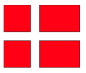
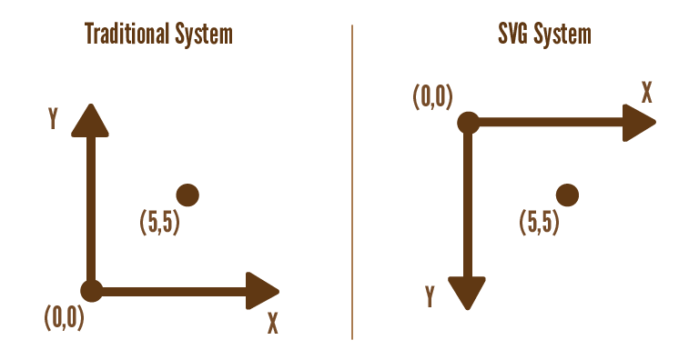

# 1. Statiske SVG tegninger  

## Introduktion og lidt teori

HTML indholder nogle særlige tags der kan bruges til at lave tegninger. Et eksempel kunne være dette dannebrogsflag:



som er lavet med følgende stykke HTML:

```xml
<svg width="255" height=210>
   <rect x="0" y="0" height="90" width="90"
        style="stroke:#000000; fill: #ff0000"/>
   <rect x="120" y="0" height="90" width="135"
        style="stroke:#000000; fill: #ff0000"/>
   <rect x="0" y="120" height="90" width="90"
        style="stroke:#000000; fill: #ff0000"/>
   <rect x="120" y="120" height="90" width="135"
        style="stroke:#000000; fill: #ff0000"/>
</svg>
```

For at tegne med SVG (og de fleste andre systemer) er der mindst fire dele man skal forstå:

1. De grafiske grundelementer man har til rådighed. Typisk er det linjer, kasser, polylinier, tekst mv. Hver især har de egenskaber man kan indstille: farver, linjetykkelse, mv.

2. [Koordinatsystemet](http://tutorials.jenkov.com/svg/svg-viewport-view-box.html). Udfordringen er, at man her ofte arbejder med mere end et koordinat system ad gangen - det fysiske (på skærmen - målt i pixels) og det logiske som bruges til at placere grundelementerne i. Det logiske koordinatsystem vil man typisk vælge i enheder, som svarer til den verden man repræsenterer. F.eks. i forhold til de mål en carport har.

3. [Transformationer](http://tutorials.jenkov.com/svg/svg-transformation.html). Disse er skalering, rotation og translation (flytning) af grundelementerne.

4. [Gruppering](http://tutorials.jenkov.com/svg/g-element.html) af grundelementer. Hvordan man kan samle et antal grundelementer, så de sammen kan flyttes, roteres osv.

## Ressourcer

Der er flere steder på nettet, som giver tutorials i SVG. Det er ikke noget I behøver at kigge på, men det kan være nyttigt som referencemateriale.

- [Mozilla SVG Docs](https://developer.mozilla.org/en-US/docs/Web/SVG) er en god reference med mange detaljer.
- [Jakob Jenkov](http://tutorials.jenkov.com/svg/index.html) har lavet en der kommer omkring det meste af hvad I får brug for.
- Det at placere tekst helt perfekt er noget pille arbejde.
  - Dels har [Jenkov](http://tutorials.jenkov.com/svg/text-element.html) noget.
  - [Denne side er også god](http://apike.ca/prog_svg_text_style.html).
- Artiklen [“SVG: A Scene Description Language”](http://math.hws.edu/graphicsbook/c2/s7.html) er en god og præcis introduktion til SVG. Der er også en god introduktion til hvordan man kan bruge vektorgrafik til modellering af sammensatte figurer (afsnit 2.7.4 Hierarchical Models()).

## Forklaring på flagkoden

I eksemplet med flaget ovenfor, så erklærer `svg` elementet den canvas vi har at skrive på. De fysiske dimensioner er 255 pixels bredt, og 210 højt (flagets proportioner er [standardiserede](https://da.wikipedia.org/wiki/Dannebrog)).

De grundelementer vi arbejder med, er udelukkende rektangler (angivet med `rect` tagget). Egenskaben `stroke` siger at der skal være en kant, som her er sort (angivet som RGB værdi), mens `fill` siger at rektanglet skal fyldes med rødt. Bemærk at disse egenskaber er i en `style` attribut, og man kan derfor gøre det til genstand for CSS styles hvis man vil.

Det fysiske og logiske koordinat system er her det samme (da vi ikke har angivet at det skal være forskelligt). Mere om det herunder:

### Koordinatsystem

Husk på at X-aksen er fra venstre til højre som sædvanligt, mens Y er *oppefra og ned*.

Det kartesiske koordinatsystem vi normalt kender fra matematikundervisningen vender positive Y-værdier opad, så her skal man være opmærksom:



Et simpelt eksempel på at skifte koordinat system er, at vi ikke har brug for så stort et flag. I stedet for at lave alle koordinaterne om, så angiver vi i SVG elementet en `viewBox` som er det logiske koordinat system. Et flag i halv størrelse er kan laves med:

```xml
<svg width="127" height=105 viewBox="0 0 255 210">
   <rect x="0" y="0" height="90" width="90"
        style="stroke:#000000; fill: #ff0000"/>
   ... Resten som før
</svg>
```

Her siger vi, at vi vil have en canvas der kun er `127 x 105`, mens det koordinat system vi bruger til vores tegning stadig er fra (0,0) til (255,210).

I får nok ikke brug for ret meget mere i denne omgang, men I kan læse mere om ViewBox vs ViewPort på [Jakob Jenkov’s side om dette](http://tutorials.jenkov.com/svg/svg-viewport-view-box.html). Hvis I mod forventning har brug for at gå amok med koordinatsystemer, så [skal i have fat i transformationer](http://tutorials.jenkov.com/svg/svg-transformation.html).

### Øvelser og tjekspørgsmål

I det følgende skal du arbejde med en række øvelser, som gradvist introducerer begreberne ovenfor. Du ender med at have lavet en tegning af en carport set ovenfra.

Der er også indsat lidt onus-spørgsmål undervejs hist og her, hvor du kan tænke lidt over det du har lært. Som her:

### Bonus-spørgsmål

<details>
<summary>Givet punktet (50, 600). Hvad er x og hvad er y?</summary>
Svar: x = 50 og y = 600?
</details>

God fornøjelse.

[Gå til forsiden](./README.md) | [Næste øvelse (2/7)](./static_02.md)
