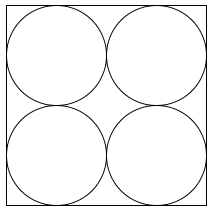

# 2. Statiske SVG tegningner

## Lav din første tegning

Når du skal eksperimentere med SVG kan du gøre det på to måder:

### 1. Flad SVG-fil

Lav en flad fil i IntelliJ, som gemmes med `.svg` som filtype. Der findes et preview-mode i IntelliJ, så du løbende kan se ændringerne.

```xml
<svg  xmlns="http://www.w3.org/2000/svg"
    xmlns:xlink="http://www.w3.org/1999/xlink"
    width="127" height="105"  viewBox="0 0 255 210">
<rect x="0" y="0" height="90" width="90"
    style="stroke:#6dab6e; fill: #6d6fab"/>
<rect x="120" y="0" height="90" width="135"
    style="stroke:#000000; fill: #ff0000"/>
<rect x="0" y="120" height="90" width="90"
    style="stroke:#000000; fill: #ff0000"/>
<rect x="120" y="120" height="90" width="135"
    style="stroke:#000000; fill: #ff0000"/>
</svg>
```

### 2. Indsæt dit svg-tag i en html side

Lav en html-side i IntelliJ og kopier følgende ind i filen:

```html
<!DOCTYPE html>
<html lang="en">
<head>
    <meta charset="UTF-8">
    <title>SVG Flag Demo</title>
</head>
<body>

<h1>Flag</h1>

<svg width="127" height="105" viewBox="0 0 255 210">
    <rect x="0" y="0" height="90" width="90"
        style="stroke:#000000; fill: #ff0000"/>
    <rect x="120" y="0" height="90" width="135"
        style="stroke:#000000; fill: #ff0000"/>
    <rect x="0" y="120" height="90" width="90"
        style="stroke:#000000; fill: #ff0000"/>
    <rect x="120" y="120" height="90" width="135"
        style="stroke:#000000; fill: #ff0000"/>
</svg>

</body>
</html>
```

Nu kan tegningen vises i en browser.

Bemærk at det ikke er nødvendigt at indsætte name-space information i svg-elementet når det er indeholdt i en html side.

### 3. Svensk flag

Lav det danske flag fra forrige lektion om til først det svenske flag:


### Cirkler i en boks

Lav nu 4 cirkler i en box á la:



Det kræver at du regner lidt på koordinaterne. Så tag en lommeregner frem.

### Bonus spørgsmål

<details>
<summary>
Givet punktet (50, 600). Dvs, at x = 50 og y = 600. Hvilken retning afsættes punktet i på websiden? Peger x mod højre, venstre, op eller ned? Og hvad retning peger y?
</summary>
X går mod højre for stigende x.
Og y peger selvfølgelig nedad for stigende y.
</details>

[Gå til forsiden](./README.md) | [Forrige øvelse (1/7)](./static_01.md) | [Næste øvelse (3/7)](./static_03.md)
