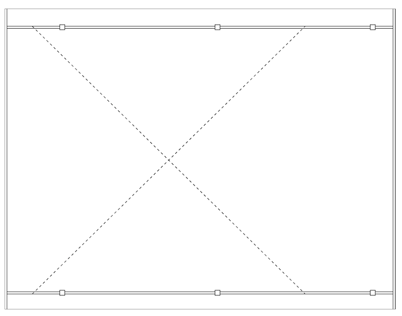

# 3. Statiske SVG tegningner

## Tegning af en simpel carport

Lav en statisk hjemmeside med et billede af en minimal carport set fra oven.

Øvelsen kan bruges som første skridt til en tegning i stil med den i dokumentet [6,0 X 7,8 MTR](./docs/CP01_DUR_vejledning_2016.pdf) side 5. Tegningen kunne f.eks. se ca. således ud:



*Figur 1: Simpel carport*

Hints:

1. Undlad at gøre plads til tallene langs siderne i første omgang. Men tegn en ramme rundt langs hele kanten af billedet. Rammen skal være 6 x 7,8 meter. Denne øvelse handler om at lave SIMPEL SVG tegning.
2. Tegn de to ende-spær som er helt ude ved kanten.
3. Tegn de to remme - placer dem rigtigt i forhold til rammen.
4. Tegn krydset - se om du kan få det stiplet.
5. Lav stolperne.

### Bonus spørgsmål

<details>
<summary>
Hvordan ser de to `line`- elementer du har brugt til at tegne de stiplede linier?
</summary>

```xml
<line x1="55" y1="35" x2="600" y2="569.5" style="stroke:#000000; stroke-dasharray: 5 5;" />
<line x1="55" y1="569.5" x2="600" y2="35" style="stroke:#000000; stroke-dasharray: 5 5;" />
```

</details>

### Vejledende løsning (hvis du er kørt fast)

<details markdown="block">

<summary>
Du må gerne kigge her - men prøv først selv. Du kan altid tjekke din løsning op i mod denne.
</summary>

```xml
<?xml version="1.0" ?>

<svg version="1.1" xmlns="http://www.w3.org/2000/svg" xmlns:xlink="http://www.w3.org/1999/xlink"
     viewBox="0 0 800 600">

    <!-- The scene description goes here!  -->

    <!-- Ramme -->
    <rect x="0" y="0" height="600" width="780" style="stroke:#000000; fill: #ffffff" />

    <!-- Remme -->
    <rect x="0" y="35" height="4.5" width="780" style="stroke:#000000; fill: #ffffff" />
    <rect x="0" y="565" height="4.5" width="780" style="stroke:#000000; fill: #ffffff" />

    <!-- Spær -->
    <rect x="0" y="0" height="600" width="4.5" style="stroke:#000000; fill: #ffffff" />
    <rect x="55" y="0" height="600" width="4.5" style="stroke:#000000; fill: #ffffff" />
    <rect x="110" y="0" height="600" width="4.5" style="stroke:#000000; fill: #ffffff" />
    <rect x="775.5" y="0" height="600" width="4.5" style="stroke:#000000; fill: #ffffff" />

    <!-- Kryds -->
    <line x1="55" y1="35" x2="600" y2="569.5" style="stroke:#000000; stroke-dasharray: 5 5;" />
    <line x1="55" y1="569.5" x2="600" y2="35" style="stroke:#000000; stroke-dasharray: 5 5;" />

    <!-- Stolper -->
    <rect x="110" y="32" height="9.7" width="9.7" style="stroke:#000000; fill: #ffffff" />
    <rect x="420" y="32" height="9.7" width="10" style="stroke:#000000; fill: #ffffff" />
    <rect x="730" y="32" height="9.7" width="10" style="stroke:#000000; fill: #ffffff" />
    <rect x="110" y="562" height="9.7" width="10" style="stroke:#000000; fill: #ffffff" />
    <rect x="420" y="562" height="9.7" width="10" style="stroke:#000000; fill: #ffffff" />
    <rect x="730" y="562" height="9.7" width="10" style="stroke:#000000; fill: #ffffff" />
</svg>
```

</details>

[Gå til forsiden](./README.md) | [Forrige øvelse (2/7)](./static_02.md) | [Næste øvelse (4/7)](./static_04.md)
