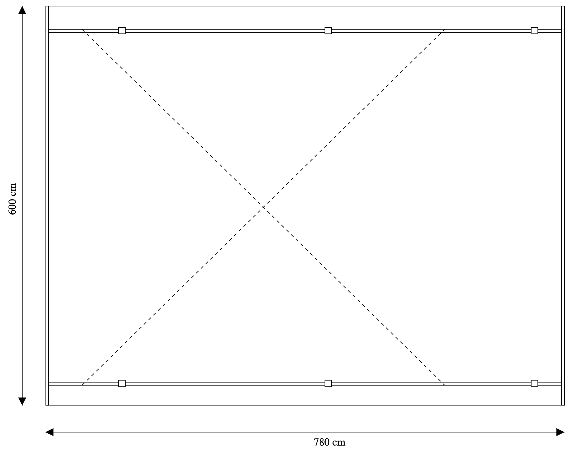

# 4. Statiske SVG tegningner - overblik

## Carport med pile og cm-mål

Denne side er ikke en øvelse, men et overblik:

Nu skal vi se, om vi kan få de to størrelses-orden streger på. Her skal vi benytte os af et trick, nemlig at man kan tage en tegning og gøre den til en del-tegning. Vi får desuden brug for at tegne pile.

Målet er at lave denne tegning:

I de næste to øvelser skal I først lære at tegne pile og derefter at sætte en tegning ind i en anden tegning - eller mere korrekt - en canvas ind i en anden canvas.

[Gå til forsiden](./README.md) | [Forrige øvelse (3/7)](./static_03.md) | [Næste øvelse (5/7)](./static_05.md)
