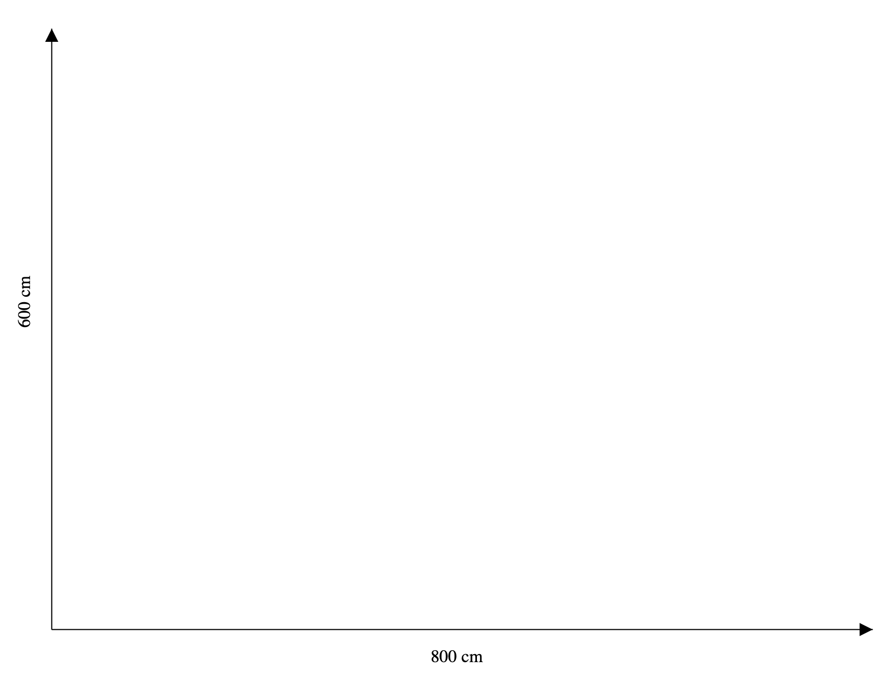

# 6. Statiske SVG tegningner - tekst

## Indsæt og placer tekst i SVG

Lige som man kan lave grundelementer som linjer, rektangler mv, så kan man også skrive tekst på sine tegninger.

Med udgangspunkt i den forrige øvelse, skal vi nu sætte forklarende tekst på koordinatsystemet:



### Opgave: Lav tegningen ovenfor i SVG

Hint: Når du skal lave tekst, så brug SVG elementet `text` og transform-attributten til at rotere og translatere teksten. F.eks. således:

```XML
<text style="text-anchor: middle" transform="translate(30,300) rotate(-90)">600 cm</text>
```

- `text-anchor: middle` betyder at teksten centreres ud fra det angivne koordinat.
- `translate(30,300)` betyder at teksten flyttes 30 pixels til højre og 300 nedad
- `rotate(-90)` betyder at teksten roteres 90 grader mod urets retning.
- Når flere transforms sættes sammen, så udføres de fra højre mod venstre. Dvs, at teksten først roteres og så tranlateres den.

### Bonus-spørgsmål

<details>
<summary>
Hvad betyder det at `translatere`?
</summary>
Svar: Translation, (af lat. translatio 'overføring, flytning', af trans- og afledn. af latus 'flyttet, ført'), i fysik en bevægelse, hvor alle punkter af et legeme har samme hastighed. I almindelighed er et fast legemes bevægelse sammensat af translation og rotation.
</details>

### Vejledende løsning

<details markdown="block">
<summary>
Hvis du er kørt fast - så lur her
</summary>

```xml
<?xml version="1.0" ?>

<svg version="1.1"
     xmlns="http://www.w3.org/2000/svg"
     xmlns:xlink="http://www.w3.org/1999/xlink"
     height="100%" viewBox="0 0 855 690"
     preserveAspectRatio="xMinYMin">

    <defs>
        <marker id="beginArrow" markerWidth="12" markerHeight="12" refX="0" refY="6" orient="auto">
            <path d="M0,6 L12,0 L12,12 L0,6" style="fill: #000000;" />
        </marker>
        <marker id="endArrow" markerWidth="12" markerHeight="12" refX="12" refY="6" orient="auto">
            <path d="M0,0 L12,6 L0,12 L0,0 " style="fill: #000000;" />
        </marker>
    </defs>

    <!-- Ramme -->
    <!-- Pile -->
    <line x1="50" y1="600" x2="50" y2="50" style="stroke:#000000;
        marker-end: url(#endArrow);" />

    <line x1="50" y1="600" x2="800" y2="600" style="stroke:#000000;
        marker-end: url(#endArrow);" />

    <text style="text-anchor: middle" transform="translate(30,300) rotate(-90)">600 cm</text>
    <text style="text-anchor: middle"  transform="translate(420,630)" >800 cm</text>
</svg>
```

</details>

[Gå til forsiden](./README.md) | [Forrige øvelse (5/7)](./static_05.md) | [Næste øvelse (7/7)](./static_07.md)
