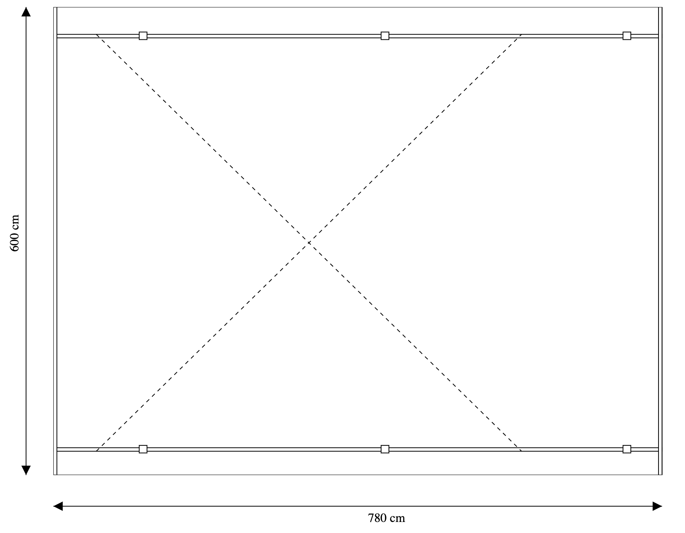

# 7. Statiske SVG tegningner - del-tegninger

## Indsæt en tegning i en tegning

Lige som man kan lave grundelementer som linjer, rektangler mv, så kan man også placere et andet SVG element inde på en eksisterende canvas.

Med udgangspunkt i tegningen af den flade carport, skal vi tilføje to pile og to labels der viser længde og bredde på carporten:



*Figur 1: Simpel carport med måleangivelser*

Herunder ses en skitse til hvordan man indlejrer en svg-tegning i en anden tegning:

```XML
<svg version="1.1" 
 xmlns="http://www.w3.org/2000/svg" 
 xmlns:xlink="http://www.w3.org/1999/xlink" 
 height="100%" viewBox="0 0 855 690" 
 preserveAspectRatio="xMinYMin">
 
 <svg version="1.1" 
  xmlns="http://www.w3.org/2000/svg" 
  xmlns:xlink="http://www.w3.org/1999/xlink" 
  x="75" 
  y="10" 
  width="800" 
  height="600" 
  viewBox="0 0 780 600" 
  preserveAspectRatio="xMinYMin">
  
  ..... Den indre tegning af den simple carport
  
 </svg>

  ..... Tegning af afstandsmål og angivelse af mål i cm
</svg>
```

Det vigtigste er linje 14, hvor der laves en `viewBox` for den indre svg-tegning, sådan at alt det der tegnes, kan tegnes, som om hele det element ligger i (0,0) og ikke som det faktisk er tilfældet, i (75,10).

## Øvelse

Tegn nu den simple carport med måleangivelser fra figur 1.

### Bonus-spørgsmål

<details>
<summary>

Hvad er det nu `ViewBox` indeholder? Er det enheder fra den virkelige verden (World Coordinates), eller er det størrelsen på hele tegningen (Canvas) i pixels?

</summary>

Svar: Det er enheder fra den virkelige verden. Fx. i centimeter på vores carport. Vores ViewBox mål sørger SVG så for at skalere til `width` og `height`.

</details>

### Vejledende løsning

<details>
<summary>
Hvis du er kørt fast - så lur her
</summary>

```xml
<?xml version="1.0" ?>

<svg version="1.1"
     xmlns="http://www.w3.org/2000/svg"
     xmlns:xlink="http://www.w3.org/1999/xlink"
     height="100%" viewBox="0 0 855 690"
     preserveAspectRatio="xMinYMin">

    <defs>
        <marker id="beginArrow" markerWidth="12" markerHeight="12" refX="0" refY="6" orient="auto">
            <path d="M0,6 L12,0 L12,12 L0,6" style="fill: #000000;" />
        </marker>
        <marker id="endArrow" markerWidth="12" markerHeight="12" refX="12" refY="6" orient="auto">
            <path d="M0,0 L12,6 L0,12 L0,0 " style="fill: #000000;" />
        </marker>
    </defs>

    <!-- Ramme -->


    <!-- Pile -->
    <line x1="40" y1="10" x2="40" y2="610" style="stroke:#000000;
        marker-start: url(#beginArrow);
        marker-end: url(#endArrow);" />

    <line x1="75" y1="650" x2="855" y2="650" style="stroke:#000000;
        marker-start: url(#beginArrow);
        marker-end: url(#endArrow);" />

    <!-- Text: Mål -->
    <text style="text-anchor: middle" transform="translate(30,300) rotate(-90)">600 cm</text>
    <text style="text-anchor: middle" x="502" y="670">780 cm</text>

    <svg version="1.1" xmlns="http://www.w3.org/2000/svg" xmlns:xlink="http://www.w3.org/1999/xlink" x="75" y="10" width="800" height="600" viewBox="0 0 780 600" preserveAspectRatio="xMinYMin">

        <!-- The scene description goes here!  -->

        <!-- Ramme -->
        <rect x="0" y="0" height="600" width="780" style="stroke:#000000; fill: #ffffff" />

        <!-- Remme -->
        <rect x="0" y="35" height="4.5" width="780" style="stroke:#000000; fill: #ffffff" />
        <rect x="0" y="565" height="4.5" width="780" style="stroke:#000000; fill: #ffffff" />

        <!-- Spær -->
        <rect x="0" y="0" height="600" width="4.5" style="stroke:#000000; fill: #ffffff" />
        <rect x="775.5" y="0" height="600" width="4.5" style="stroke:#000000; fill: #ffffff" />

        <!-- Kryds -->
        <line x1="55" y1="35" x2="600" y2="569.5" style="stroke:#000000; stroke-dasharray: 5 5;" />
        <line x1="55" y1="569.5" x2="600" y2="35" style="stroke:#000000; stroke-dasharray: 5 5;" />

        <!-- Stolper -->
        <rect x="110" y="32" height="9.7" width="10" style="stroke:#000000; fill: #ffffff" />
        <rect x="420" y="32" height="9.7" width="10" style="stroke:#000000; fill: #ffffff" />
        <rect x="730" y="32" height="9.7" width="10" style="stroke:#000000; fill: #ffffff" />
        <rect x="110" y="562" height="9.7" width="10" style="stroke:#000000; fill: #ffffff" />
        <rect x="420" y="562" height="9.7" width="10" style="stroke:#000000; fill: #ffffff" />
        <rect x="730" y="562" height="9.7" width="10" style="stroke:#000000; fill: #ffffff" />
    </svg>

</svg>
```

</details>

Ding dong. Du er nu færdig med de statiske SVG tegninger. Tillykke! Nu skal lære at sætte SVG tegninger ind i en `Thymeleaf template` via en Javalin backend. Hop ud til [forsiden](./README.md) - og kom videre derfra. God fornøjelse.

[Gå til forsiden](./README.md) | [Forrige øvelse (6/7)](./static_06.md)
