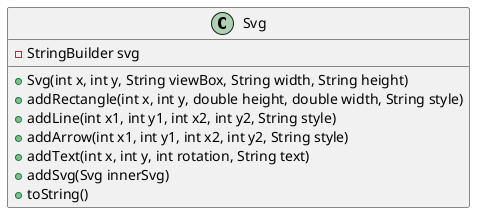

# Dynamiske SVG tegninger

## 1. Introduktion (specs)

Nu skal vi generere `SVG` fra Java. Hele ideen bygger på indsigten om at:

> `SVG er en række af tegn - en tekst-streng, som opfylder`SVG` standarden.

Derfor skal vi lave en hjælpe-klasse i Java, hvor man kan bygge tekst-strengene op lidt ad gangen, og hvor man kan kalde de grundliggende `SVG` primitiver:

- `<svg>`
- `<line>`
- `<rectangle>`
- `<text>`
- `<defs>` og `<markers>` til pile

Man skal også kunne indsætte en `SVG`-tegning inden i en anden.

Det giver tilsammen følgende klasse-diagram:

I det følgende angiver vi en løsning til hvordan man i grove træk kan implementere `Svg`-klassen og hvordan man kan bygge en hel carport. Så se de følgende video-tutorials og kod med undervejs.

## 2. Programmering af Svg klassen

- Se denne [Videotutorial: Svg#1]()

## 3. Anvendelse af Svg klassen

- Se denne [Videotutorial: Svg#2]()

## 4. Idé til hvordan man tegner en hel carport

- Se denne [Videotutorial: Svg#3]()
