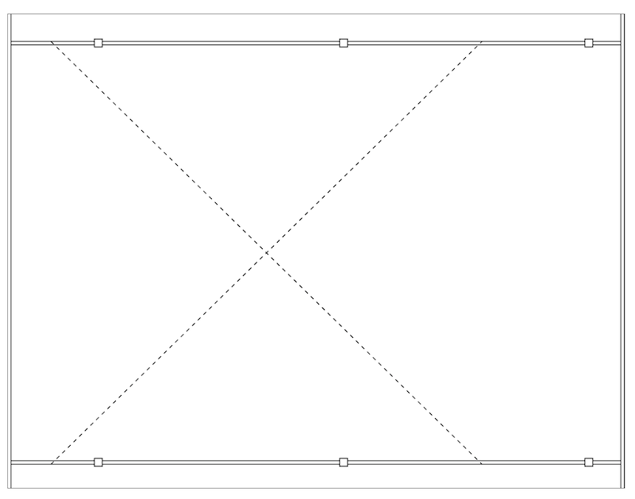

# 3. Statiske SVG tegningner - carport

## Tegning af en simpel carport

Lav en statisk hjemmeside med et billede af en minimal carport set fra oven.

Øvelsen kan bruges som første skridt til en tegning i stil med den i dokumentet [6,0 X 7,8 MTR](./docs/CP01_DUR_vejledning_2016.pdf) side 5. Tegningen kunne f.eks. se ca. således ud:


*Figur 1: Simpel carport*

Hints:

1. Undlad at gøre plads til tallene langs siderne i første omgang. Men tegn en ramme rundt langs hele kanten af billedet. Rammen skal være 6 x 7,8 meter. Denne øvelse handler om at lave SIMPEL SVG tegning.
2. Tegn de to ende-spær som er helt ude ved kanten.
3. Tegn de to remme - placer dem rigtigt i forhold til rammen.
4. Tegn krydset - se om du kan få det stiplet.
5. Lav stolperne.

### Bonus spørgsmål

<details>
<summary>
Hvordan ser de to `line`- elementer du har brugt til at tegne de stiplede linier?
</summary>
```xml
<!-- Kryds -->
<line x1="55" y1="35" x2="600" y2="569.5" style="stroke:#000000; stroke-dasharray: 5 5;" />
<line x1="55" y1="569.5" x2="600" y2="35" style="stroke:#000000; stroke-dasharray: 5 5;" />
```
</details>

[Gå til forsiden](./README.md) | [Forrige øvelse (2/6)](./static_02.md) | [Næste øvelse (4/6)](./static_04.md)
