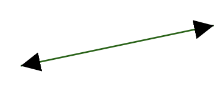
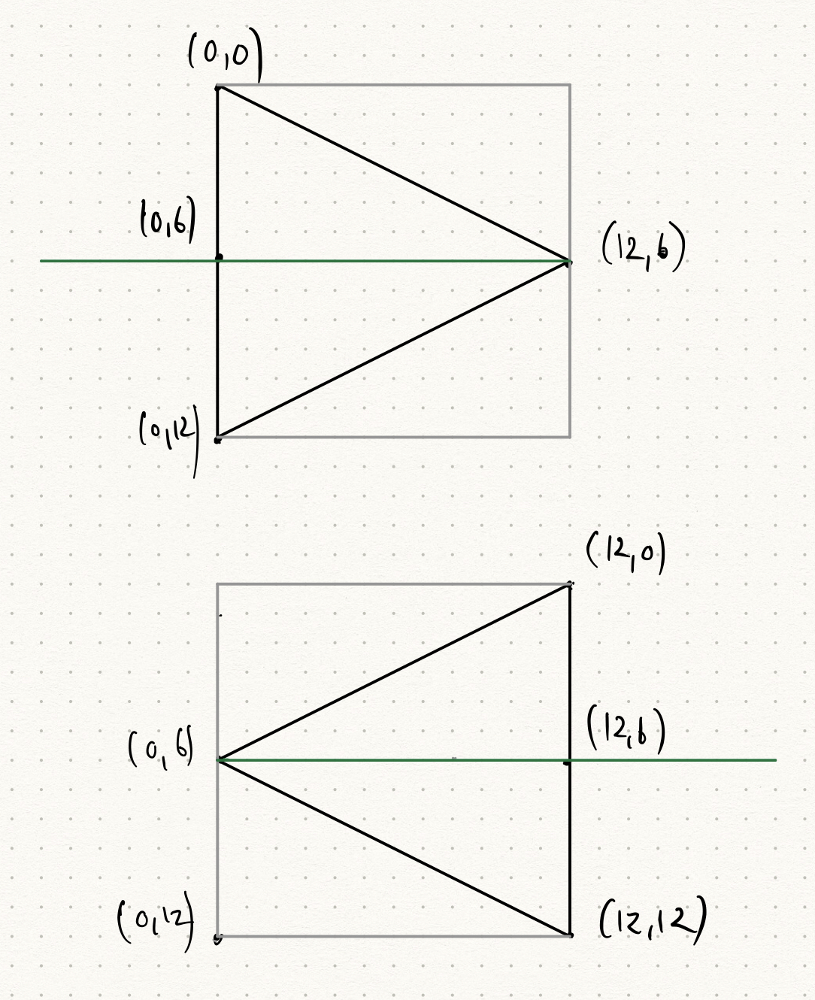
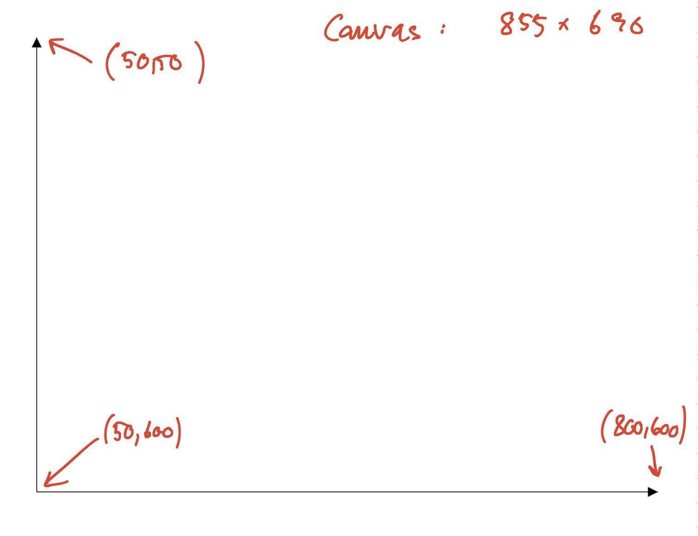

# 5. Statiske SVG tegningner - Pile

At tegne pile er overraskende finurligt, da SVG er lavet sådan, at der kan bruges alle mulige former for pilehoveder (markers). Faktisk skal man selv tegne pilehovederne - de er små SVG tegninger i sig selv.



Pilen er lavet med følgende SVG:

```xml
<SVG width="25%" viewBox="0 0 150 40">
<defs>
 <marker 
  id="beginArrow" 
  markerWidth="12" 
  markerHeight="12" 
  refX="0" 
  refY="6" 
  orient="auto">
   <path d="M0,6 L12,0 L12,12 L0,6" style="fill: #000000;" />
 </marker>
 <marker 
  id="endArrow" 
  markerWidth="12" 
  markerHeight="12" 
  refX="12" 
  refY="6" 
  orient="auto">
   <path d="M0,0 L12,6 L0,12 L0,0 " style="fill: #000000;" />
 </marker>
</defs>
<line x1="130"  y1="10" x2="12"   y2="35" 
 style="stroke: #006600;
 marker-start: url(#beginArrow);
 marker-end: url(#endArrow);" />
</SVG>
```

Bemærk at det falder i to dele - en `defs` del hvor det forklares hvordan to markere er lavet, samt en del hvor disse markere bruges til at lave pile på en linje.

Sidste del først, så skriver man hvilke markers man vil bruge som start og slut på pilen. Her nævner man de to markers fra `defs` delen.

Vi vil anbefale, at I bare kopierer de to defs til jeres projekt og bruger dem.

Men her er forklaringen.

```xml
<marker 
    id="beginArrow" 
    markerWidth="12" 
    markerHeight="12" 
    refX="0" 
    refY="6" 
    orient="auto">
    <path d="M0,6 L12,0 L12,12 L0,6" style="fill: #000000;" />
 </marker>
```

`id` er det navn vi bruger nede i linjen til at sige hvilken type pil vi vil have. `markerWidth` og `markerHeight` angiver størrelsen på pilen. Dette er en ret lille pil. Selve pilen er tegnet med en `path` kommando, der siger at først flytter vi os til (0,6) (M for move), så tegner vi en trekant ved at lave tre linjestykker (L for linje), at vi skal fylde figuren med sort (#000000). Denne lille tegning viser hvordan de to pile er lavet.



Så er der `orient="auto"` som magisk siger at pilen skal følge den linje vi laver. Endelig er der `refX` og `refY` som siger hvilket punkt i pilen der skal kobles på linjens endestykke. Jeg har her valgt pilens top, så pilen ikke rager ud over linjen.

### Øvelse

Lav et koordinatsystem som dette i SVG:



[Gå til forsiden](./README.md) | [Forrige øvelse (4/6)](./static_04.md) | [Næste øvelse (6/6)](./static_06.md)
