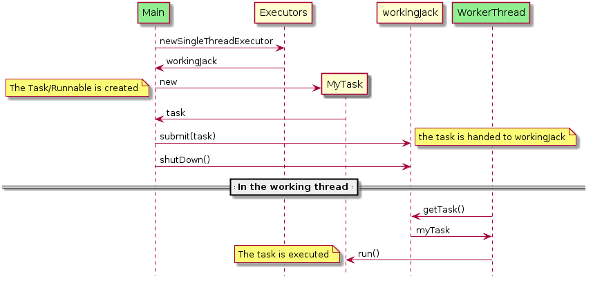

# Tråde og Executors
Når I bruger jeres computer kan man have mere end et program igang på samme tid. Man kan godt skrive en email mens man hører musik. Moderne computere har mere end en "core", din har måske 2,4,6 eller flere. Men på trods af dette faste antal kan du alligevel godt køre mere 2 eller 6 programmer samtidigt.

Dette sker ved at operativ systemet har flere processer. Den kører så hver process en lille smule (5-50 ms), og skifter så til en anden process. Da mennesker er utroligt langsomme i opfattelsen ser det ud som alle programmerne kører samtidigt. Men operativ systemet skifter altså mellem 20 og 200 gange i sekundet.

Java tillader os at skrive programmer der benytter sig af mere end en process. I Java kaldes processer for **Threads - på dansk tråde**. Programmering med mere end en tråd kaldes **concurrent**, **tråd** eller **parallel** programmering. Der er nogle der mener der er forskel på de forskellige betegnelser - I praksis mener alle cirka det samme, og ingen har kunne definere et standard ordbrug alle er blevet enige om.

Vi skal i denne uge arbejde med concurrency, men ikke med den primitive Java tråd, men med et bibliotek der tilbyder noget der kaldes **Executors** som gør det nemmere at programmere de opgaver man typisk har brug for at løse vha. tråde.

### Executors
Det centrale i executor biblioteket er at man har minimum to tråde. Den ene tråd venter på indput fra brugeren - i vores tilfælde på at der kommer et HTTP request. Hvis det tager lang tid at udføre dette request (f.eks fordi vi skal hente noget i en database), kan vores web server ikke tage imod request fra den næste bruger før vi har færdig behandlet første request.

Vi skal altså have en måde hvor server tråden kan bede en anden tråd om at udføre det arbejde der hører til at *håndtere* requestet, sådan at server tråden hurtigt kan komme tilbage til at lytte efter næste request.

Der skal være en måde hvor server tråden kan fortælle den anden tråd hvad den skal lave. En sådan opgave er en klasse der implementerer et interface `Runnable`, som blot har en opgave der hedder `run()`.

Dette program (Executor01 i ugens udlevering) viser det basale:

```java
package dat.sem2.threads;

import java.util.concurrent.ExecutorService;
import java.util.concurrent.Executors;

public class Executor01 {

    public static void main( String[] args ) {
        ExecutorService workingJack = Executors.newSingleThreadExecutor();
        System.out.println( "Creates tasks for workingJack" );
        for ( int i = 0; i < ; i++ ) {
            workingJack.submit( new Runnable() {
                @Override
                public void run() {
                    System.out.println( "Hello to us" );
                }
            } );
        }
        System.out.println( "Waits for workingJack to finish" );
        workingJack.shutdown();
    }
}
```

I linje 9 oprettes en `ExecutorService`. Det er et objekt som vores main kan give opgaver. Objektet `workingJack` er det objekt vi kan give opgaver. Klassen `Executors` har et par forskellige metoder til at oprette ExecutorServices med. Den der er brugt her siger at der er afsat en tråd til at udføre opgaverne. (`newSingleThreadExecutor()`).

I linje 12 er der en metode der hedder `submit()`. Det er den centrale metode hvor vi giver en instans af af Runnable med metoden run som siger hvad vi gerne vil have gjort (linje 12-17). Her skriver vi bare noget ud for at se at opgaven er udført. Men det er her opgaven egentlig skal udføres.

I linje 10 og i linje 19 udskriver main-tråden (den tråd der starter main metoden) så vi kan se rækkefølgen af ting.

Når jeg kører programmet får jeg:

```
Creates tasks for workingJack
Waits for workingJack to finish
Hello to us
Hello to us
Hello to us
Hello to us
Hello to us
```
Altså, så når main-tråden til linje 20 og venter før `workingJack` får lavet noget som helst.

## Eksempel `Executor03()`

Arbejdsfordelingen mellem main og executor tråden kan ses i følgende diagram:

 

Denne type diagram kaldes et uml sekvens diagram. Vi kommet tilbage til dem senere på semesteret hvor I selv skal lave dem. Ideen i Executer er at Main tråden laver en opgave i form af en Runable (i diagrammet `MyTask`) som den indsætter i ExecutorServicen (her kaldet `workingJack`). 

Jeg har i diagrammet tegnet tråde med grønt - det er noget jeg har fundet på - der er ikke en standard for det.
`WorkerThread` opdager at der ligger en opgave hos `workingJack` som den henter med `getTask()`. Fordi `MyTask` implementerer `Runable` kan `WorkerThread` kalde metoden `run()` på `MyTask` objektet. 

Alt i alt har vi i `Main` tråden lavet et opgave objekt (`MyTask`), lagt det i kø hos `workingJack`, og `WorkingThread` har udført opgaven.

Main siger med `shutDown()` at der ikke kommer flere opgaver, og `WorkingThread` kan stoppe når alle opgaver der måtte ligge hos `workingJack` er udført.

### Opgave parametre
Meget ofte har opgaven man vil bede en ExecutorService om at udføre nogle input parametre. I vores WebServer kan det f.eks. være Http requestet. 

Måden hvorpå man laver parametre kan også ses i `Executor03()`. Parametrene overføres i forbindelse med kontruktøren til `MyTask`.

### Returværdier
Ligesom man kan have brug for at give parametre med til en opgave kan man være interessert i at få resultater tilbage fra tasks udført af en executor. Det er ikke pensum i dette semester.
