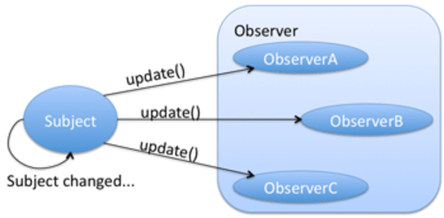
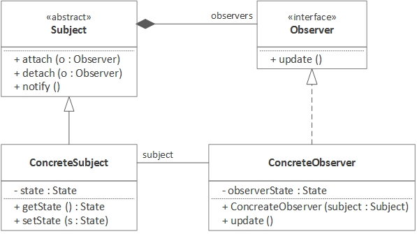

# Øvelse: Chat-server

Formålet med denne øvelse, er at prøve kræfter med både tråd- og netværksprogrammering.

Det er ikke en let øvelse, men vi begynder med en meget simpel version, som senere kan udvides til at omfatte flere funktionaliteter.

Her er hvad ChatGPT foreslår som strategi (konceptuel beskrivelse):

Building a simple chat server in Java that can handle multiple clients and distribute messages to all connected clients involves understanding sockets, threads, and server-client architecture. Here's a conceptual outline of how to build such a server:

## 1. Server Setup

- **Socket Programming**: Use Java's `ServerSocket` class to create a server that listens for incoming client connections on a specified port.
- **Accepting Clients**: When a client tries to connect, the `ServerSocket` accepts the connection and creates a `Socket` instance for that client. This process is usually done in a loop, running in a separate thread to handle multiple clients.
- **Client Handler**: For each connected client, instantiate a separate thread (or use a thread pool to manage multiple threads efficiently) to handle the communication. This thread will be responsible for reading messages from the client and broadcasting them to other clients.

## 2. Client Management

- **Tracking Clients**: Maintain a list or a similar data structure to keep track of all currently connected clients. This structure is essential for broadcasting messages to all clients.
- **Synchronized Access**: Ensure synchronized access to the list of clients to prevent concurrent modification exceptions. This can be achieved using synchronized blocks or collections like `ConcurrentHashMap`.

## 3. Communication

- **Reading Messages**: Use input streams (e.g., `BufferedReader` over an `InputStreamReader`) to read messages sent by clients.
- **Broadcasting Messages**: When a message is received from a client, iterate over the list of connected clients and send the message to each client (except the sender, if desired). Use output streams (e.g., `PrintWriter` or `OutputStreamWriter`) for sending messages.

## 4. Client Side

- **Connecting to the Server**: Clients use the `Socket` class to connect to the server by specifying its IP address and the port number.
- **Sending and Receiving Messages**: Similar to the server, use input and output streams to send and receive messages. Implement a separate thread for listening to messages from the server to keep the UI responsive.

## 5. Cleanup and Resource Management

- **Handling Disconnections**: Implement a way to detect when a client has disconnected (e.g., by catching EOFException or checking for null inputs) and remove them from the list of connected clients.
- **Closing Resources**: Ensure that sockets, streams, and other resources are properly closed in a finally block or using the try-with-resources statement to avoid resource leaks.

## Example Structure

- **Server Class**: Implements the main server logic, including listening for new connections and managing client threads.
- **ClientHandler Class**: A runnable that handles all communication with a connected client.
- **Client Class**: Used to connect to the server and interact with it.

## Technical Considerations

- **Concurrency**: Handling concurrency is crucial in a multi-client setup. Be mindful of synchronizing access to shared resources.
- **Scalability**: For a real-world application, consider using non-blocking I/O (NIO) or frameworks like Netty that are more scalable than traditional blocking I/O.

This is a high-level overview. Implementing a chat server can be an excellent project for understanding network programming, threads, and real-time communication in Java.


## Observer pattern

Følgende kogebogsopskrift fra ChatGPT, kan vi måske bruge som inspiration. Observer pattern (OP) er et af de mest anvende i branchen.

Læs evt. denne [fantatiske beskrivelse af OP](https://howtodoinjava.com/design-patterns/behavioral/observer-design-pattern/).

Her er lidt figurer fra artiklen:

### OP Principle



### Going full UML on OP



### What ChatGPT would recommend

Prompt: "How would you implement the observer pattern in the chat application?"

Implementing the Observer pattern in a small chat application using Java involves creating a straightforward communication mechanism where the chat server (Observable) notifies all connected clients (Observers) of new messages. Here's a basic outline of how you might design and implement this pattern:

### Step 1: Define Observer and Observable Interfaces

First, define interfaces for both the Observer and the Observable to standardize the methods needed for communication.

```java
// Observer interface for clients
public interface Observer {
    void update(String message);
}

// Observable interface for the chat server
public interface Observable {
    void registerObserver(Observer o);
    void removeObserver(Observer o);
    void notifyObservers(String message);
}
```

### Step 2: Implement the Chat Server (Observable)

The chat server will implement the `Observable` interface. It keeps track of clients (observers) and notifies them of new messages.

```java
import java.util.ArrayList;
import java.util.List;

public class ChatServer implements Observable {
    private final List<Observer> observers = new ArrayList<>();

    @Override
    public void registerObserver(Observer o) {
        observers.add(o);
    }

    @Override
    public void removeObserver(Observer o) {
        observers.remove(o);
    }

    @Override
    public void notifyObservers(String message) {
        for (Observer observer : observers) {
            observer.update(message);
        }
    }

    // Method to receive messages from a client
    public void receiveMessage(String message) {
        notifyObservers(message);
    }
}
```

### Step 3: Implement the Client (Observer)

Each client will implement the `Observer` interface, allowing it to receive messages from the chat server.

```java
public class ChatClient implements Observer {
    private final String clientName;

    public ChatClient(String name) {
        this.clientName = name;
    }

    @Override
    public void update(String message) {
        System.out.println("[" + clientName + "] New message: " + message);
    }

    // Method to send a message to the server
    public void sendMessage(ChatServer server, String message) {
        server.receiveMessage("[" + clientName + "]: " + message);
    }
}
```

### Step 4: Putting It All Together

Finally, you can create a small test to see how the server and clients work together.

```java
public class ChatApp {
    public static void main(String[] args) {
        ChatServer server = new ChatServer();

        ChatClient client1 = new ChatClient("Alice");
        ChatClient client2 = new ChatClient("Bob");

        // Register clients with the server
        server.registerObserver(client1);
        server.registerObserver(client2);

        // Simulate clients sending messages
        client1.sendMessage(server, "Hi, everyone!");
        client2.sendMessage(server, "Hello, Alice!");
    }
}
```

This example demonstrates a basic implementation of the Observer pattern for a chat application. It does not include details such as handling connections, threading, or networking aspects, which are crucial for a real-world application but beyond the scope of this explanation. For a complete chat application, you would need to integrate Java Sockets for network communication, manage threads for handling multiple client connections simultaneously, and potentially include a user interface for clients to interact with the chat.

<hr/>

1. [Øvelser med simple tråde](./exercises_threads.md)
2. [Øvelser med brug af Executor frameworket](./exercises_executor.md)
3. [Øvelser i samtidighedsproblematikker](./exercises_concurrency_problems.md)
4. [Oplæg til større opgave med udvikling af en chat-server](./exercises_chatserver.md)
