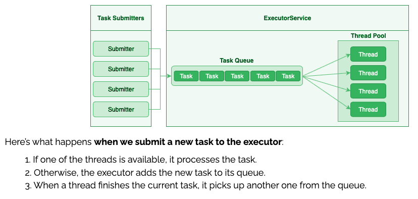

# Øvelser - Executors

Det centrale i executor biblioteket er at man har minimum to tråde. Den ene tråd venter på input fra brugeren - i vores tilfælde på at der kommer et HTTP request. Hvis det tager lang tid at udføre dette request (f.eks fordi vi skal hente noget i en database), kan vores web server ikke tage imod request fra den næste bruger før vi har færdig behandlet første request.

Vi skal altså have en måde hvor server tråden kan bede en anden tråd om at udføre det arbejde der hører til at *håndtere* requestet, sådan at server tråden hurtigt kan komme tilbage til at lytte efter næste request.

Der skal være en måde hvor server tråden kan fortælle den anden tråd hvad den skal lave. En sådan opgave er en klasse der implementerer et interface `Runnable`, som blot har en opgave der hedder `run()`.

Figuren herunder viser en konceptuel udgave af det indre af ExecutorService:


(Kilde: [Source](https://www.baeldung.com/java-rejectedexecutionhandler))

## Før du går i gang

Lav en ny package i dit projekt og kald den `executors`. Læg de næste øvelser herunder.

## Øvelse 1: Brug af Executor Framework

## 1.1 Før du går i gang

Lav en ny package i `executores` pakken og kald den `exercise01`.

Dette program viser det basale:

```java
import java.util.concurrent.ExecutorService;
import java.util.concurrent.Executors;

/**
 * Formålet med denne demo er at vise, hvordan man bruger en ExecutorService med en enkelt tråd.
 */
public class Demo01ExecutorService {

    public static void main( String[] args ) {
        ExecutorService workingJack = Executors.newSingleThreadExecutor();
        System.out.println( "Creates tasks for workingJack" );
        for ( int i = 0; i < 5; i++ ) {
            workingJack.submit( new Runnable() {
                @Override
                public void run() {
                    System.out.println( "Hello to us" );
                }
            } );
        }
        System.out.println( "Waits for workingJack to finish" );
        workingJack.shutdown();
        System.out.println( "All done" );
    }
}
```

## 1.2 Kopier klassen ind i dit projekt (copy/paste)

I linje 9 oprettes en `ExecutorService`. Det er et objekt som vores `main` kan give opgaver. Objektet `workingJack` er det objekt vi kan give opgaver. Klassen `Executors` har et par forskellige metoder til at oprette ExecutorServices med. Den der er brugt her siger at der er afsat en tråd til at udføre opgaverne. (`newSingleThreadExecutor()`).

I linje 12 er der en metode der hedder `submit()`. Det er den centrale metode hvor vi giver en instans af af Runnable med metoden run som siger hvad vi gerne vil have gjort (linje 12-17). Her skriver vi bare noget ud for at se at opgaven er udført. Men det er her opgaven egentlig skal udføres.

I linje 10 og i linje 19 udskriver main-tråden (den tråd der starter main metoden) så vi kan se rækkefølgen af ting.

Når jeg kører programmet får jeg:

```text
Creates tasks for workingJack
Waits for workingJack to finish
Hello to us
Hello to us
Hello to us
Hello to us
Hello to us
```

Altså, så når main-tråden til linje 20 og venter før `workingJack` får lavet noget som helst.

## Øvelse 2: Refaktorer ["Øvelse 1: Tre tråde"](./exercises_threads.md#%C3%B8velse-1-tre-tr%C3%A5de)

I det første [opgavesæt](./exercises_threads.md#%C3%B8velse-1-tre-tr%C3%A5de) anvendte vi simple tråde. Omskriv koden, så du i stedet anvender Executors. Så lav en ny package i `executores` pakken og kald den `exercise02`.

Forklar koden til din sidemakker - og specielt hvad der er det smarte ved Executors frem for almindelige tråde.

Så er vi klar til at anvende Executors. Dem skal vi bruge de næste par dage.

<hr/>

1. [Øvelser med simple tråde](./exercises_threads.md)
2. [Øvelser med brug af Executor frameworket](./exercises_executor.md)
3. [Øvelser i samtidighedsproblematikker](./exercises_concurrency_problems.md)
4. [Oplæg til større opgave med udvikling af en chat-server](./exercises_chatserver.md)
