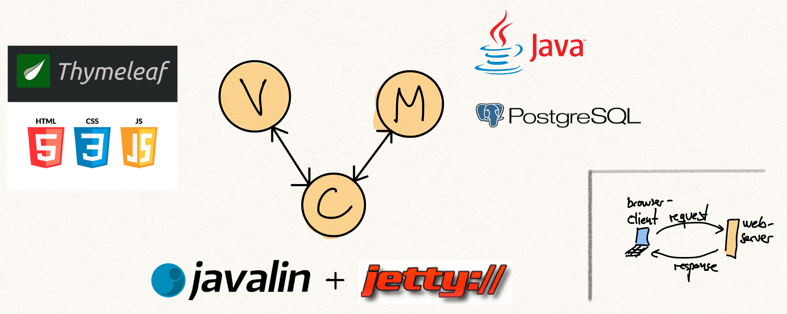

# MVC Design Pattern

The MVC (Model-View-Controller) design pattern is a software architectural pattern commonly used in web development to organize code in a way that separates its internal representations of information from the ways that information is presented to and accepted from the user. This separation facilitates a modular approach to application development, making it easier to manage, scale, and maintain. The three components of the MVC pattern are:

1. **Model**: The Model represents the data and business logic of the application. It manages the data, logic, and rules of the application. In web development, the Model would typically interact with a database or any other storage system and include all the necessary logic to retrieve data, insert data, update data, and delete data. For example, in a blog application, the Model would handle tasks such as saving new articles, fetching articles, updating articles, and deleting articles.

2. **View**: The View is responsible for presenting data from the Model to the user in a particular format. It is the component that deals with displaying the application's user interface and user experience. The View retrieves data from the Model and renders it for the user. In web development, the View would be composed of HTML, CSS, and JavaScript to create the layout and presentation of web pages. The View is what the user sees and interacts with in their web browser, such as forms, buttons, images, and other elements.

3. **Controller**: The Controller acts as an intermediary between the Model and the View. It receives user input, processes it (possibly updating the Model), and returns the output display (View) to the user. The Controller interprets the user's actions, such as clicking a button or submitting a form, and translates them into operations that the Model or View can perform. It controls the data flow into Model objects and updates the View whenever data changes. It keeps the View and Model separate.

In a web application using the MVC design pattern, the flow of control is as follows:

1. The user interacts with the View, such as submitting a web form.
2. The Controller receives this input as a request, processes it (perhaps modifying the Model as a result), and decides which View should be displayed next.
3. The View uses the Model to obtain any necessary data and renders it to the user.
4. The user sees the response as a webpage.

This pattern helps in separating concerns, making web applications easier to test, maintain, and extend over time. For example, developers can work on the Model, View, and Controller independently as long as they agree on the interfaces between them. This separation also allows for parts of the application to be updated or replaced without affecting other components.

## Placing Java, Javalin, Thymeleaf, HTML, CSS, Javascript, and Postgresql in an MVC context

Let's place each of the mentioned technologies within the MVC (Model-View-Controller) context for a web application development scenario:

1. **Java**: Java is a versatile and powerful programming language that serves as the foundation for many web and enterprise applications. Within the MVC context, Java is often used to write the business logic of the application, making it part of the **Model** component. Java can be used to interact with databases, perform calculations, handle user authentication, and manage application state and behavior.

2. **Javalin**: Javalin is a lightweight web framework for Kotlin and Java designed to be simple and fast. It allows developers to quickly create web applications and services with minimal boilerplate code. In the MVC pattern, Javalin fits into the **Controller** component. It handles incoming HTTP requests, routes them to the appropriate controller methods, and determines the response to send back to the client, whether it's rendering a View or returning JSON/XML responses.

3. **Thymeleaf**: Thymeleaf is a modern server-side Java template engine for web and standalone environments. It's used for rendering HTML views in web applications. Therefore, Thymeleaf falls into the **View** component of the MVC pattern. It dynamically generates HTML content on the server-side by processing templates and merging them with data models provided by the Controller, which interacts with the Model for data.

4. **HTML/CSS**: HTML (HyperText Markup Language) and CSS (Cascading Style Sheets) are standard technologies for creating and designing web pages. They are essential for defining the structure and style of the web pages, thus belonging to the **View** component in the MVC context. HTML is used to structure the content on the web page, while CSS is used for styling and laying out web pages.

5. **JavaScript**: JavaScript is a powerful scripting language used to create dynamic and interactive user interfaces for web applications. It runs on the client's browser and is part of the **View** component in the MVC architecture. JavaScript can manipulate HTML and CSS, allowing the creation of rich interactive web applications. It can also communicate with the server-side, fetching data asynchronously without needing to refresh the page, through the use of APIs or AJAX.

6. **PostgreSQL**: PostgreSQL is a sophisticated open-source object-relational database system. It provides the storage and retrieval of data for web applications. In the MVC framework, PostgreSQL is used within the **Model** component. It stores the application's data, and the Model interacts with PostgreSQL to create, read, update, and delete records based on the business logic and user actions interpreted by the Controller.

7. **Java (Reiteration for Context)**: When specifically interacting with PostgreSQL or performing any form of data manipulation and business logic implementation, Java is used within the **Model** layer to manage these interactions, establish connections to the database, and execute SQL queries.

In summary, within an MVC context:

- **Model**: Java (business logic, data manipulation), PostgreSQL (data storage)
- **View**: Thymeleaf (template engine for dynamic HTML generation), HTML/CSS (page structure and styling), JavaScript (client-side dynamics and interactivity)
- **Controller**: Javalin (routing and handling HTTP requests)

[Back to Design Pattern overview](./README.md)
