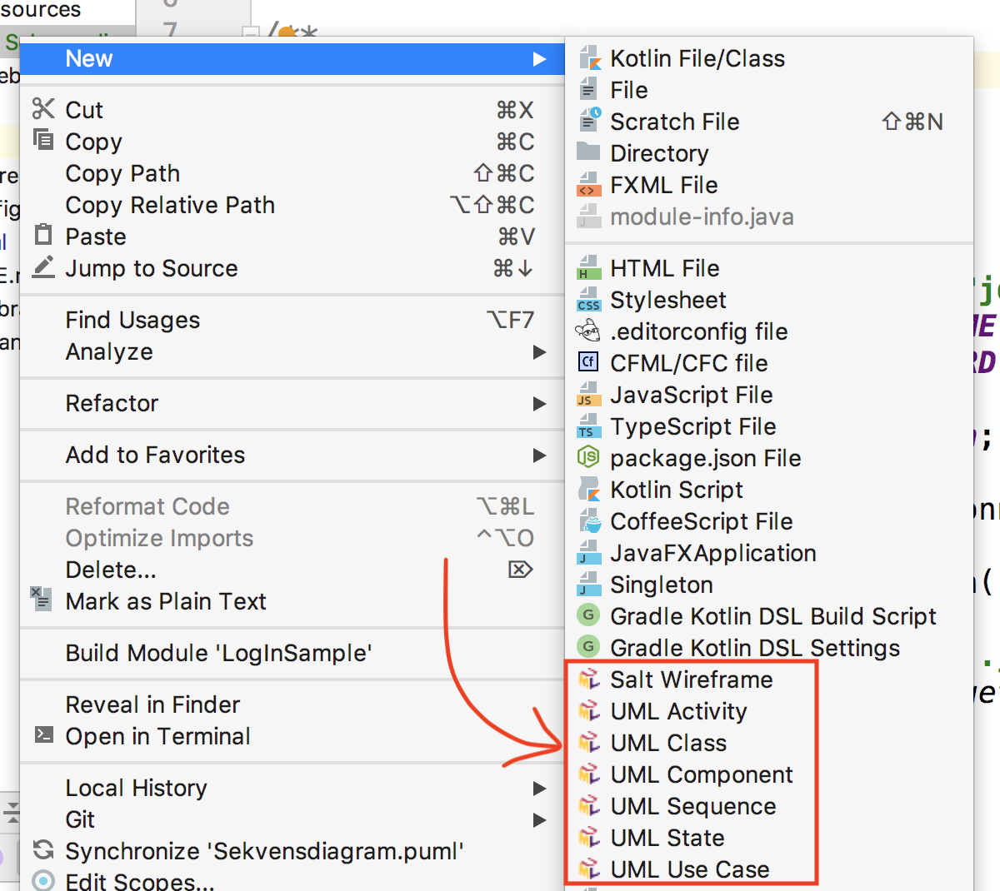

# PlantUML

Der er mange værktøjer til at tegne diagrammer. Denne note vil kort beskrive et af disse - et som egner sig godt til brug på git og github.

Git kan godt lide tekstfiler, og PlantUML er en tekst syntaks til at beskrive UML diagrammer. Det har et automatiseret layout som gør at man ikke skal bruge tid på layout af diagrammer (og bare må acceptere når der laves dårlig layout).

PlantUML kan bruges til at lave:

* Domæne modeller (klasse diagrammer)
* Aktivitetsdiagrammer
* Sekvens diagrammer
* Tilstandsdiagrammer (state charts) (vi bruger dem til at beskrive navigation med)
* Og meget mere

Der er to ressourcer der nyttige til disse værktøj:

* [PlantUMLs hjemmeside](http://plantuml.com/). Denne er noget rodet, men der er eksempler på alle UML diagrammer og hvordan man laver dem.
* [Planttext](https://www.planttext.com/) som er en simpel side hvor man kan skrive sine diagrammer i browseren så man kan se hvordan diagrammet kommer til at se ud.
* Man kan også lave diagrammer med PlantUML notation direkte fra IntelliJ via et plugin

## PlantUML i IntelliJ

Hvis man virkelig vil kaste sig over at bruge PlantUML så kan man bruge et plugin i IntelliJ. Det skal ses som alternativ til at bruge [planttext](https://www.planttext.com/). Fordelen er, at du kan inkludere dine diagrammer direkte i projektet, og dermed få koden på GitHub.

1. Søg på “PlantUML integration” i IntelliJs “Preferences -> Plugins” og installer.
2. Genstart IntelliJ

Nu bør du så være istand til at arbejde med plant UML is IntelliJ direkte ved at højreklikke på en folder, vælg New og UML-diagramtype. Se billede nedenfor:

* * *

[UML forside](README.md) | [PlantUML](./plantuml.md) | [Tutorials](./tutorials.md)
