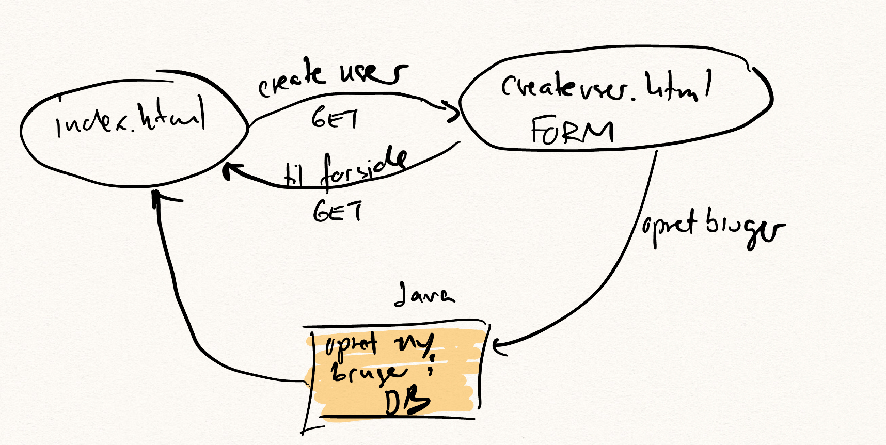

# Four Things Plus

Denne tutorial er tænkt om et "selvstudium", hvor du sideløbende med undervisningen på skolen, kan sidde i ro og mag og arbejde dig igennem en længere sammenhængende case. F.eks. på de dage, hvor vi ikke har undervisning.

Sørg for at kode med i IntelliJ hele vejen, og tag lidt noter undervejs.
Fx. med de spørgsmål du evt. måtte have.

- Her er et [link til en mappe med alle videoer](https://cphbusiness.cloud.panopto.eu/Panopto/Pages/Sessions/List.aspx?folderID=ad84da6d-abc5-4098-8cde-b12d01493556) (de kommer dumpende i løbet af ugen)

## Nå men nu til opgaven

Vi skal bygge en huskeseddel applikation. Det er som bekendt svært at holde mere end tre ting i hovedet, så derfor skal vi bygge en lille webapplikation, som  vi kalder for **"fourthingsplus"**.

- Her er en lille [mockup lavet i Figma](https://www.figma.com/proto/EAJhgUIiODZop8WOQHplUl/Todoist?page-id=0%3A1&node-id=1%3A3&viewport=593%2C479%2C1.26&scaling=scale-down&starting-point-node-id=1%3A3). Alternativt se mockups nederst på siden.

## Plan

1. Først udarbejder vi et use-case diagram
2. Dernæst beskrives hver use-case som en user story
3. På baggrund af det laver vi en simpel domænemodel og på baggrund af den et ER-diagram (ERD) over databasen.
4. Så går vi i gang med at kode. Først oprettes et Java / Maven projekt i IntelliJ ([instruktioner](./javalin/setup.md))
5. Dernæst oprettes en database i Postgres og der lægges lidt fake data ind i tabellerne.
6. Når alt dette er på plads begynder vi at implementere de enkelte user stories en ad gangen.
7. Lidt efter lidt begynder vi også at style siderne, så udseende begynde at ligne de udleverede mockups.
8. Vi vil også refaktorere koden løbende når det er mest oplagt. Dvs, at I ikke får den færdige løsning fra starten, men det er noget vi arbejder hen imod.

## Her er et logo vi kan sakse


## Mockups (i stedet for Figma)


## Foranalyse: usecase diagram og user stories (dokumentation)


## Foranalyse: datamodel (dokumentation)


## SQL

```sql
-- Database: fourthingsplus

CREATE TABLE public.task (
    task_id integer NOT NULL,
    name character varying NOT NULL,
    done boolean DEFAULT false NOT NULL,
    user_id integer NOT NULL
);

CREATE SEQUENCE public.task_task_id_seq
    AS integer
    START WITH 1
    INCREMENT BY 1
    NO MINVALUE
    NO MAXVALUE
    CACHE 1;

CREATE TABLE public.users (
    user_id integer NOT NULL,
    user_name character varying(50) NOT NULL,
    password character varying(50)
);

CREATE SEQUENCE public.users_user_id_seq
    AS integer
    START WITH 1
    INCREMENT BY 1
    NO MINVALUE
    NO MAXVALUE
    CACHE 1;

ALTER TABLE ONLY public.task ALTER COLUMN task_id SET DEFAULT nextval('public.task_task_id_seq'::regclass);

ALTER TABLE ONLY public.users ALTER COLUMN user_id SET DEFAULT nextval('public.users_user_id_seq'::regclass);

INSERT INTO public.task VALUES (1, 'Se Jons videoer', false, 1);

INSERT INTO public.users VALUES (1, 'jon', '1234');

SELECT pg_catalog.setval('public.task_task_id_seq', 1, true);

SELECT pg_catalog.setval('public.users_user_id_seq', 1, true);

ALTER TABLE ONLY public.task
    ADD CONSTRAINT task_pkey PRIMARY KEY (task_id);

ALTER TABLE ONLY public.users
    ADD CONSTRAINT user_name_unique UNIQUE (user_name);

ALTER TABLE ONLY public.users
    ADD CONSTRAINT users_pkey PRIMARY KEY (user_id);

ALTER TABLE ONLY public.task
    ADD CONSTRAINT fk_user_task FOREIGN KEY (user_id) REFERENCES public.users(user_id) NOT VALID;
```

## Datamappers and custom exceptions gists

- [DatabaseException](https://gist.github.com/jonbertelsen/ee38f3acf9263724c59d9a832629ad0c)

- [UserMapper.java](https://gist.github.com/jonbertelsen/8914972cdf5677039152be26b5676125)

- [TaskMapper.java](https://gist.github.com/jonbertelsen/30736832172437ea12bfc7715cf1f462)

## State diagram: login


## State diagram: create user



## State diagram: edit and update task


