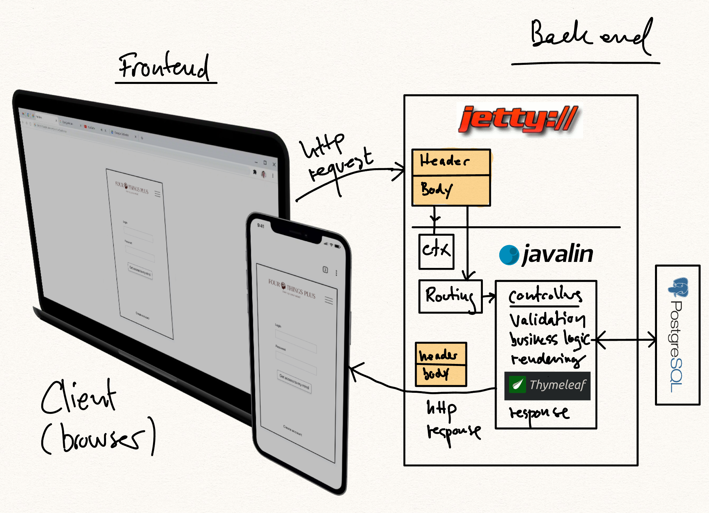

# How a request/response cycle is handled

This is a rough description of a request/response cycle. The focus is on where the responsibility for each part of the handling is carried out:

## The request

An http request is sent from the browser. A header and maybe also some data is sent. The data is carried in the request body - which is sometimes also called the `payload`.

An http request is usually either:

- GET: requesting a page. Some query parameters could be sent along in the header. Like `http://dr.dk?id=1&cat=dr1`.

- POST: usually creating new entities on the server. Some payload are added to the request. Usually as form-data.

- UPDATE. This method is mostly used sending update requests to an API endpoint.

- DELETE. This method is mostly used sending a delete request to an API endpoint.

## Receiving the request

This is the role of the webserver. In our case: "Jetty" which listens on a port. Jetty also parses the http-header. The header properties and the payload can be accessed in Javalin through the `ctx` object. An example could be `ctx.header("Host")`. Data from the browser can be extracted in Javalin as `ctx.formParam("username")` or `ctx.queryParam("id")`.

## Executing the request

In Javalin the `route handlers` / `controllers` carries out the business logic, validates the input data, executes crud operations on the database etc.
This code we write ourselves in Java.

## Preparing the response

When the business logic is executed we prepare the response for the client. In other words: what we want to send back to the requesting browser. The final response is in our case a piece of html. The html is generated by the help of our template engine `Thymeleaf`. To do that we might add some data to the `ctx` object maps. Like `ctx.attribute` or `ctx.sessionAttribute`. And lastly we render an html page: `ctx.render("page.html")`. The render method uses Thymeleaf to render the page - and after that sends the response with correct http header etc. The html is sent as payload.
