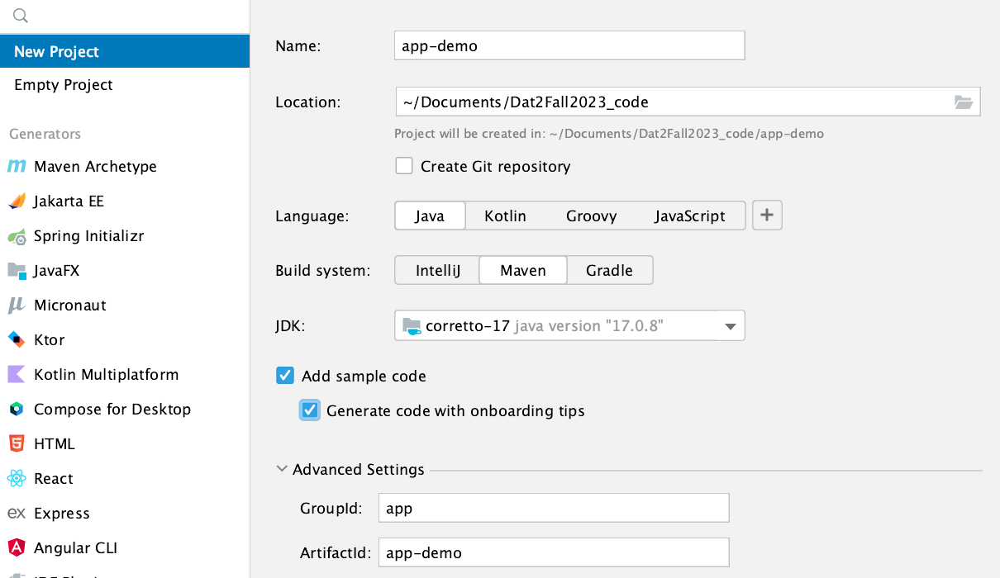
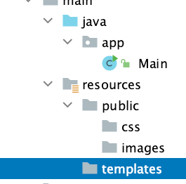

{: width="100" .float-right}

# Creating a brand new Javalin web project in IntelliJ

Learn how to get started building websites with Javalin and Thymeleaf.

## Tech-stack

| Technology  | Version  |
|---|---|
| JDK | 17   |
| Javalin  | 6.1.3  |
| Thymeleaf  | 3.1.2  |
| Maven  | 3.9.2  |  
| IntelliJ  | 2023.3.4 (Ultimate)  |

## 1. New project in IntelliJ

First create a brand new project in IntelliJ. Remember to add a `groupId` called "app" and tick the "Add sample code".



## 2. Pimp the pom.xml file

We need a load of dependencies and plugins. So override your default pom.xml file with this version:

```xml
<?xml version="1.0" encoding="UTF-8"?>
<project xmlns="http://maven.apache.org/POM/4.0.0"
         xmlns:xsi="http://www.w3.org/2001/XMLSchema-instance"
         xsi:schemaLocation="http://maven.apache.org/POM/4.0.0 http://maven.apache.org/xsd/maven-4.0.0.xsd">
    <modelVersion>4.0.0</modelVersion>

    <groupId>app</groupId>
    <artifactId>fourthingsplusdb</artifactId>
    <version>1.0-SNAPSHOT</version>
    <packaging>jar</packaging>

    <name>${project.artifactId}</name>

    <properties>
        <maven.compiler.source>17</maven.compiler.source>
        <maven.compiler.target>17</maven.compiler.target>
        <javalin.version>6.1.3</javalin.version>
        <javalin-rendering.version>6.1.3</javalin-rendering.version>
        <thymeleaf.version>3.1.2.RELEASE</thymeleaf.version>
        <thymeleaf-extras.version>3.0.4.RELEASE</thymeleaf-extras.version>
        <slf4j.version>2.0.12</slf4j.version>
        <jackson.version>2.17.0-rc1</jackson.version>
        <hikariCP.version>5.1.0</hikariCP.version>
        <junit.version>5.10.2</junit.version>
        <hamcrest.version>2.2</hamcrest.version>
        <postgresql.version>42.7.2</postgresql.version>

        <project.build.sourceEncoding>UTF-8</project.build.sourceEncoding>
    </properties>

    <dependencies>
        <dependency>
            <groupId>io.javalin</groupId>
            <artifactId>javalin</artifactId>
            <version>${javalin.version}</version>
        </dependency>
        <dependency>
            <groupId>org.slf4j</groupId>
            <artifactId>slf4j-simple</artifactId>
            <version>${slf4j.version}</version>
        </dependency>
        <dependency>
            <groupId>io.javalin</groupId>
            <artifactId>javalin-rendering</artifactId>
            <version>${javalin-rendering.version}</version>
        </dependency>
        <dependency>
            <groupId>org.thymeleaf</groupId>
            <artifactId>thymeleaf</artifactId>
            <version>${thymeleaf.version}</version>
        </dependency>
        <dependency>
            <groupId>org.thymeleaf.extras</groupId>
            <artifactId>thymeleaf-extras-java8time</artifactId>
            <version>${thymeleaf-extras.version}</version>
        </dependency>
        <dependency>
            <groupId>com.fasterxml.jackson.core</groupId>
            <artifactId>jackson-databind</artifactId>
            <version>${jackson.version}</version>
        </dependency>
        <dependency>
            <groupId>com.zaxxer</groupId>
            <artifactId>HikariCP</artifactId>
            <version>${hikariCP.version}</version>
        </dependency>
        <dependency>
            <groupId>org.postgresql</groupId>
            <artifactId>postgresql</artifactId>
            <version>${postgresql.version}</version>
        </dependency>
        <dependency>
            <groupId>org.junit.jupiter</groupId>
            <artifactId>junit-jupiter-api</artifactId>
            <version>${junit.version}</version>
            <scope>test</scope>
        </dependency>
        <dependency>
            <groupId>org.junit.jupiter</groupId>
            <artifactId>junit-jupiter-engine</artifactId>
            <version>${junit.version}</version>
            <scope>test</scope>
        </dependency>
        <dependency>
            <groupId>org.hamcrest</groupId>
            <artifactId>hamcrest</artifactId>
            <version>${hamcrest.version}</version>
            <scope>test</scope>
        </dependency>

    </dependencies>

    <build>

        <finalName>app</finalName>

        <plugins>
            <plugin>
                <groupId>org.apache.maven.plugins</groupId>
                <artifactId>maven-compiler-plugin</artifactId>
                <version>3.10.1</version>
                <configuration>
                    <source>17</source>
                    <target>17</target>
                </configuration>
            </plugin>
            <plugin>
                <groupId>org.apache.maven.plugins</groupId>
                <artifactId>maven-shade-plugin</artifactId>
                <version>3.4.1</version>
                <configuration>
                    <transformers>
                        <transformer
                                implementation="org.apache.maven.plugins.shade.resource.ManifestResourceTransformer">
                            <mainClass>app.Main</mainClass>
                        </transformer>
                    </transformers>
                    <filters>
                        <filter>
                            <artifact>*:*</artifact>
                            <excludes>
                                <exclude>META-INF/*.SF</exclude>
                                <exclude>META-INF/*.DSA</exclude>
                                <exclude>META-INF/*.RSA</exclude>
                            </excludes>
                        </filter>
                    </filters>
                </configuration>
                <executions>
                    <execution>
                        <phase>package</phase>
                        <goals>
                            <goal>shade</goal>
                        </goals>
                    </execution>
                </executions>
            </plugin>
        </plugins>
    </build>

</project>
```

Yup - it's a long one, but it will make us able to later add database connection, tests, logging, and a possibility for deployment build.

Depending on your project-name, remember to rename `<artifactId>app-demo</artifactId>` to your liking.

## 3. Add a folder-structure for the frontend files

All static files for the frontend should be located in the `resources` folder. To prepare ourselves, create these folders:

- `/resources/templates`
- `/resources/public`
- `/resources/public/css`
- `/resources/public/images`

It should look like this:



## 4. Configure Javalin, Thymeleaf and Jetty

[Javalin](https://javalin.io/) is a so-called micro-framework. The application will run on a [Jetty webserver and servlet container](https://eclipse.dev/jetty/), and the html pages will be rendered through the [Thymeleaf](https://www.thymeleaf.org/) template engine.

This is how to set up the parts to get started:

First, add a package called `config` and add these two classes into it:

```Java
package app.config;

import org.thymeleaf.TemplateEngine;
import org.thymeleaf.templateresolver.ClassLoaderTemplateResolver;

public class ThymeleafConfig
{
    public static TemplateEngine templateEngine()
    {
        TemplateEngine templateEngine = new TemplateEngine();
        ClassLoaderTemplateResolver templateResolver = new ClassLoaderTemplateResolver();
        templateResolver.setPrefix("templates/"); // assuming templates are in resources/templates/
        templateResolver.setSuffix(".html");
        templateEngine.setTemplateResolver(templateResolver);
        return templateEngine;
    }
}
```

```java
package app.config;

import jakarta.servlet.SessionTrackingMode;
import org.eclipse.jetty.server.session.SessionHandler;

import java.util.EnumSet;

public class SessionConfig
{
    public static SessionHandler sessionConfig()
    {
        SessionHandler sessionHandler = new SessionHandler();
        sessionHandler.setUsingCookies(true);
        sessionHandler.setSessionTrackingModes(EnumSet.of(SessionTrackingMode.COOKIE));
        sessionHandler.setHttpOnly(true);
        return sessionHandler;
    }
}
```

Second, overwrite the main method in Main.class with this version:

```Java
public static void main(String[] args)
    {
        // Initializing Javalin and Jetty webserver

        Javalin app = Javalin.create(config -> {
            config.staticFiles.add("/public");
             config.jetty.modifyServletContextHandler(handler ->  handler.setSessionHandler(SessionConfig.sessionConfig()));
             config.fileRenderer(new JavalinThymeleaf(ThymeleafConfig.templateEngine()));
        }).start(7070);

        // Routing

        app.get("/", ctx ->  ctx.render("index.html"));
    }
```

Third, we need to add an `index.html` file in the `resources/templates` folder:

```html
<!DOCTYPE html>
<html xmlns="http://www.w3.org/1999/xhtml" xmlns:th="http://www.thymeleaf.org">

  <title>Frontpage</title>
  <meta charset="UTF-8">
  <meta name="viewport" content="width=device-width, initial-scale=1.0">
  <link href="../public/css/styles.css" th:href="@{/css/styles.css}" rel="stylesheet"/>
</head>

<body>

<h1>Welcome to the Javalin / Thymeleaf demo</h1>

<p>This is your first web application in this world</p>

</body>
</html>

```

As the last step, we need to add this css file in the `/public/css` folder. Name it `styles.css`:

```css
/* Stylesheet for the application */

h1 {
    color: #369;
    font-family: Arial, Helvetica, sans-serif;
    font-size: 3rem;
}
```

## 5. Build the project and fire up the Jetty server

Run the main method and watch the running local demo-website on <http://localhost:7070/>

Nice!
