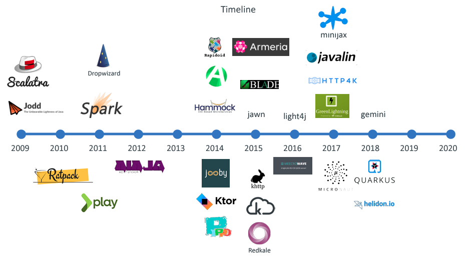

{: width="100" .float-right}

# What is Javalin?

Javalin describes itself as "A simple web framework for Java and Kotlin". Javalin is a so called "micro framework".

## What is a Java micro framework?

A micro framework in Java is a minimalistic web framework that provides the core functionalities needed to develop web applications without imposing the heavy structure and complex configurations often associated with larger, more comprehensive frameworks. These micro frameworks are designed to be lightweight, easy to use, and flexible, allowing developers to add only the components and libraries they need for a particular project. This approach can lead to faster development cycles, easier maintenance, and more efficient performance of applications.

Micro frameworks in Java often emphasize simplicity and a "bare-bones" approach to web development, focusing on essential features like routing, request handling, and response generation, while leaving other concerns like persistence, templating, and security to be integrated by the developer as needed through third-party libraries or custom code. This can be particularly appealing for building microservices, small web services, or applications where a full-fledged framework would be overkill.

Popular Java micro frameworks include Spark, Javalin, and Micronaut, each offering a different set of features and levels of abstraction, but all adhering to the principle of keeping things simple and modular. These frameworks are suitable for developers who want to have more control over their application's architecture and dependencies, enabling them to create lightweight, efficient, and tailored web applications.

If you are curious, then this analysis from 2020 on Java micro framworks is very interesting: [The ultimate micro framework smackdown - A simple web framework for Java and Kotlin](https://www.jfokus.se/jfokus20-preso/The-ultimate-microframework-smackdown.pdf) by Jaap Coomans.

## Timeline

The Java world has given rise to numerous micro frameworks over the past years. This time line (also from Jaap Coomans) shows the rich ecosystem:

## Why are we working with Javalin?

The Javalin documentation states very good [reasons for using Javalin in education](https://javalin.io/for-educators). At Cphbusiness we prefer teaching general skills in software development, and we also prefer not to be locked into proprietary technologies.

Javalin is a lively open source community, sourced under the Apache 2 license. The micro framework is openly architected. We can easily choose to slowly build on top of the basic functionality. That's very helpful when dealing with young and inexperienced students. We can start out with simplicity and build more advanced patterns and solutions on top of that as we go along.

It's also very efficient to work with Javalin. It takes less than 500ms from compiling to a fully running website in Jetty. Prior to Javalin, we worked with Java Servlets, JSP, and Tomcat. It sometimes took 10-15 seconds for the students to get a web application up'n running.

So we can definitely recommend Javalin.
