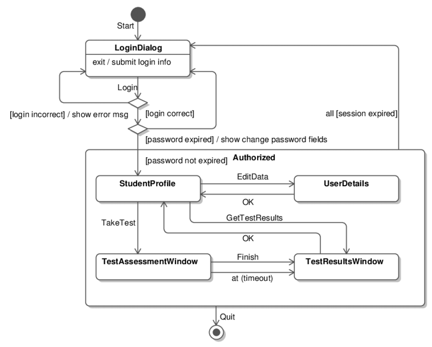

# UML State Machine Diagrams

UML State Diagrams, also known as State Machine Diagrams or simply State Diagrams, capture the different states of an object and the transitions between these states. They are especially useful for modeling objects that have a significant number of different states, like a thread, a process, or even higher-level entities like order systems.

Here are the key components and aspects of UML State Diagrams:

1. **State**:
   - Represents a specific condition or phase an object is in.
   - Illustrated using a rounded rectangle.

2. **Transition**:
   - Represents the shift from one state to another.
   - Denoted by an arrow between states.
   - Can be labeled with an event or condition causing the transition, sometimes with a slash (`/`) followed by an action resulting from that transition. For example, `buttonPressed / lightOn` would mean the event `buttonPressed` leads to the action `lightOn`.

3. **Initial State**:
   - Represents the starting state of an object before any event has occurred.
   - Shown using a filled circle.

4. **Final State**:
   - Indicates a terminal state after which no other transitions can occur for the object.
   - Depicted as a filled circle inside a larger hollow circle.

5. **Composite State**:
   - Represents a state that is composed of nested sub-states.
   - Useful for simplifying complex state diagrams where a state might have several distinct sub-states or phases.

6. **Guard Condition**:
   - A boolean expression or condition that must be true for a transition to occur.
   - Enclosed in square brackets ([ and ]) on the transition arrow.

7. **Concurrent State**:
   - Indicates that an object can be in multiple states simultaneously.
   - Shown by dividing a state box into multiple compartments.

8. **Event**:
   - A significant occurrence that can trigger a state transition.

9. **Action**:
   - A function or task performed in a particular state or when transitioning between states.

10. **Entry/Exit Point**:

- An action or event that occurs upon entering (entry) or leaving (exit) a state.

**Why Use State Diagrams?**:

- To model the lifecycle of an object, detailing its various states and how it transitions between them.
- To find potential issues in the life cycle or identify possible improvements.
- To provide clarity for complex objects with many states and transitions.

**Example Use Cases**:

- Modeling a vending machine's operation, detailing states like "waiting for selection," "processing payment," "dispensing item," etc.
- Detailing the lifecycle of a software process or thread (e.g., "starting," "running," "waiting," "terminated").
- Tracking the stages of an order in an e-commerce system (e.g., "placed," "processed," "shipped," "delivered").

In essence, State Diagrams are powerful tools for understanding and visualizing the dynamic behavior of individual objects, especially when their lifecycle is complex and consists of multiple stages or states.

## Example

### A turnstile machine

### A heating system

Note the Cooling substate

### A Website Navigation Diagram I

### A Website Navigation Diagram II

