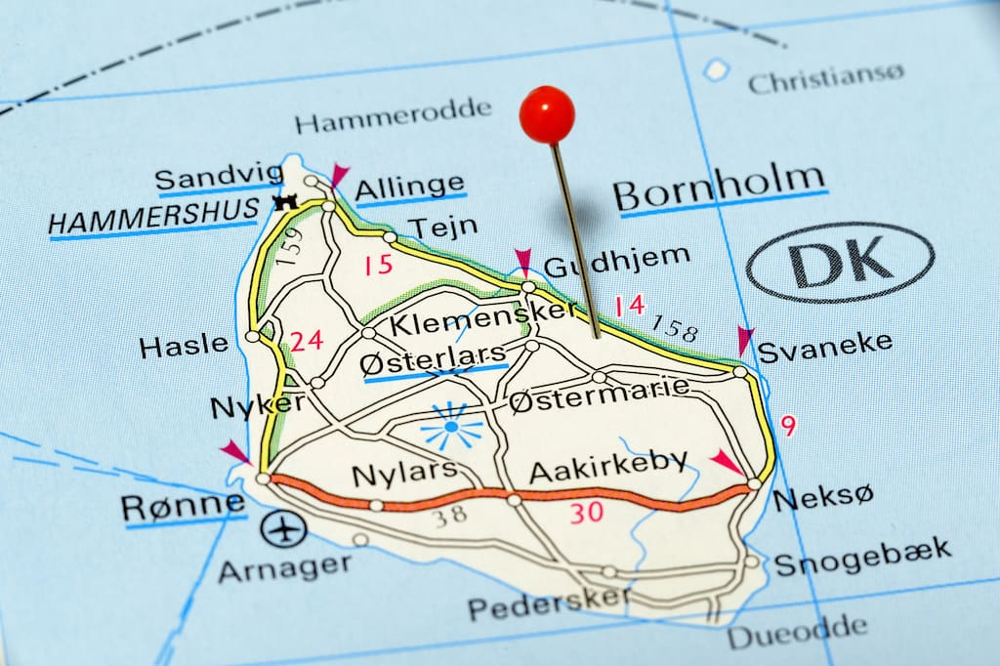

# Øvelse i UI design

## Carpool på Bornholm

### Brief

Vi er så heldige at Campus
Bornholm har valgt os til at
implementere et website, som
deres elever kan bruge til
samkørsel – til og fra Campus. Et
hold studerende har lavet en
papirsprototype, som viser hvordan
de forestiller sig brugerdiaglogen.
Næste skridt er at I skal lave en
prototype i Figma, som giver et
mere færdigt indtryk af løsningen.

### User story

Som elev skal man kunne booke
en kørelejlighed fra Allinge,
Tejn, Gudhjem, Svanneke eller
Nexø til Rønne og evt. retur.
Som bilejer skal man kunne
oprette en kørelejlighed på en
given dato og klokkeslæt til/fra
de samme byer ovenfor.

### Jeres opgave

Gå sammen 2 og 2.

1. Se videoen: [https://www.youtube.com/watch?v=ePo8VNXd0_8](https://www.youtube.com/watch?v=ePo8VNXd0_8)
2. Lav en hurtig prototype af brugerdialogen i Figma
3. I må selv om det skal være en almindelig hjemmeside eller evt. en
mobilvenlig udgave
4. Tænk over "UX-love" i jeres design
5. Lad en test-bruger prøve jeres mock-up af – og "tænke højt" undervejs.
Testbrugeren må ikke have været med til at lave mockup’en, så lån en
fra en anden gruppe
6. Overvej hvordan I vil teste brugergrænsefladen af hos jeres kunde

