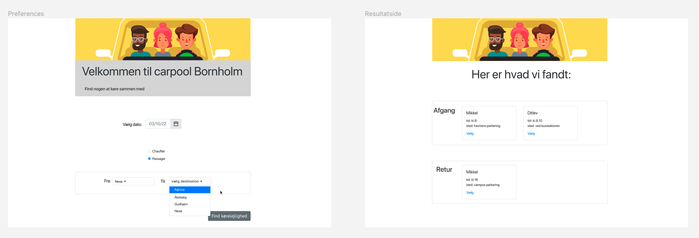
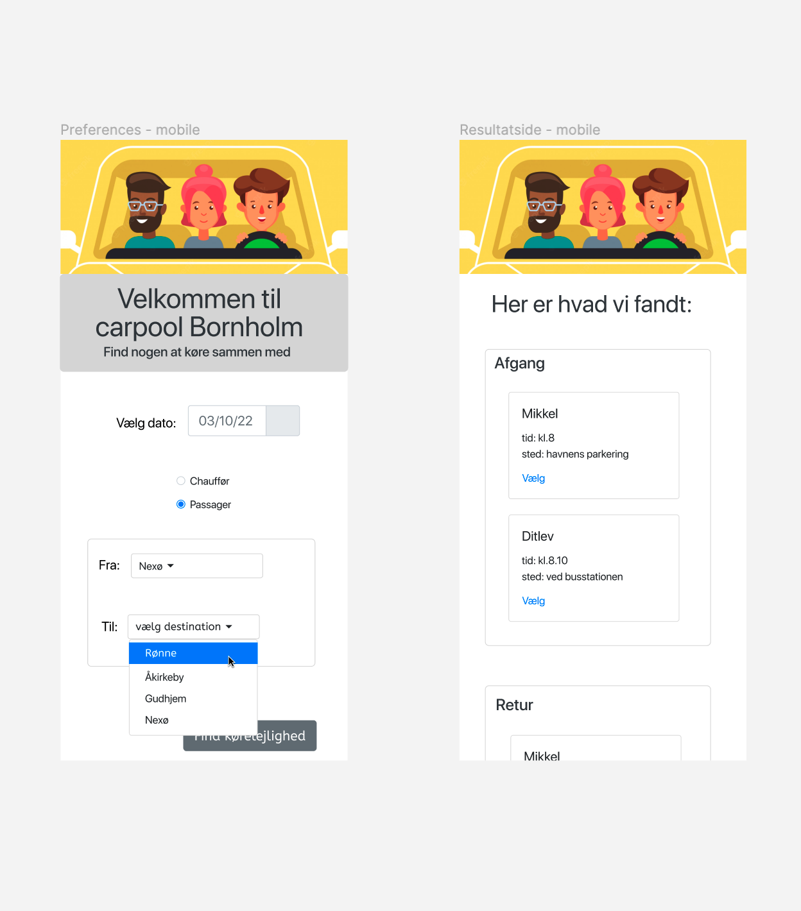
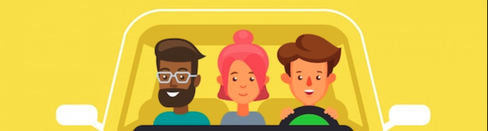

# Carpool II (responsiv version)

Du skal lave en responsiv udgave af [designet fra opgaven](./carpool.md) vi lavede i Figma forleden. Dvs, at du skal bruge html og css.

Hvis du selv har lavet en swag Figma-prototype, så lav en responsiv-version af den. Eller begynd med forsiden og se hvor langt du når.

Hvis du ikke har lavet Figma-opgaven, kan du evt. bruge denne version som inspiration: Figma artboard

## Desktop-udgave

## Mobil-udgave

## Top banner( højreklik > save image )

Hvor tæt skal man følge designet?
Det er ok at afvige her og der, men stil dig selv den udfordring at lande så tæt som muligt på designet.
Det er ok at forbedre designet, dvs. øge brugervenlighed.
