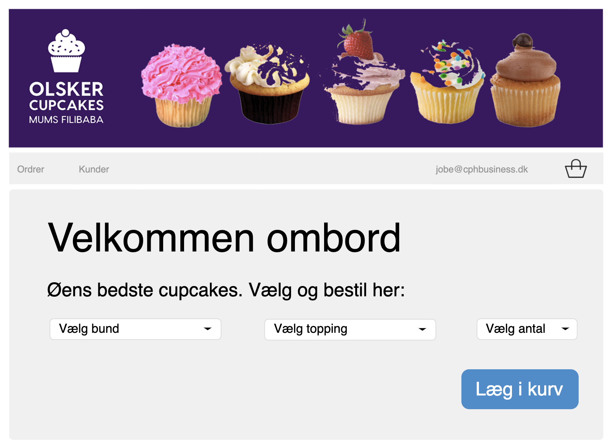

# Cupcake responsiv mockup

Vi har modtaget en mockup til en forside og lidt headergrafik. For at gøre os klar til opgaven,
skal du lave en skabelon (template) som vi kan bruge til projektet. Her er krav til skabelonen:

1. Den skal laves i html og css
2. Kald forsiden for index.html
3. Kald dit stylesheet for style.css
4. Lav en header med et stykke cupcake-grafik. Brug evt. billedet nedenfor
5. Lav et div element med en topmenu
6. Lav et div element til hovedindholdet på siden
7. Lav de viste dropdowns og knappen
8. Gør hvad du kan for at gøre siden responsiv. F.eks. ved at bruge media queries og flexbox

## Mockup

## Headergrafik

